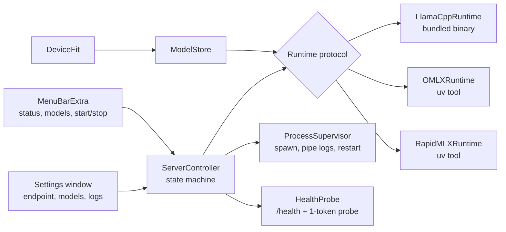
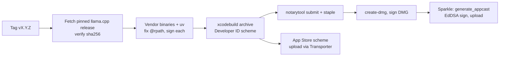

# Quail — Architecture

*As of 2026-09-21. Owner: Arif Datoo.*

Quail is a Postgres.app for local LLM servers: a menu bar item that starts a runtime, exposes an OpenAI-compatible endpoint, and gets out of the way. It manages three runtimes behind one interface (llama.cpp, oMLX, Rapid-MLX), one model folder, and one opinion about what fits on the machine.

## 1. Goals and non-goals

**In scope**

- Start, stop and supervise one runtime at a time; show status in the menu bar
- Endpoint settings: runtime, host, port, API key
- Browse, download, select and delete models in one shared store
- Recommend models that fit the device; warn on ones that don't
- Ping test: server up, model loaded, time to first token — no chat UI
- Live log viewer and "reveal log file"
- Open at login, with optional auto-start of the last runtime and model
- Install and update the Python runtimes without the user touching a terminal

**Out of scope (v1)**

- Chat, agents, image or audio generation — the runtimes' own web UIs are linked instead
- Running more than one runtime concurrently
- Linux or Intel Macs; Apple Silicon only
- Remote or multi-user hosting (Rapid-MLX's LaunchDaemon mode covers that)

**Principle:** every feature is a thin, honest view of what the runtime already exposes. If a runtime can't do something over its API or CLI, Quail doesn't fake it.

## 2. Distribution: two builds, one codebase

Ship a full Developer ID build and a reduced Mac App Store build from the same Xcode project, differing only by a build configuration flag (`APPSTORE`) and entitlements. The App Store build is llama.cpp-only; the external Python runtimes are compiled out, not hidden.

| | Developer ID (direct DMG) | Mac App Store |
| --- | --- | --- |
| Sandbox | Off (hardened runtime + notarization only) | On, mandatory |
| Bundled llama-server | Yes, spawned as a child process | Yes; helper signed with `app-sandbox` + `inherit`, inherits the app's sandbox |
| oMLX / Rapid-MLX | Yes, via app-managed uv installs | No: can't run uv, write outside the container, or spawn unsandboxed processes |
| Listening socket | Any host/port | Needs `network.server` entitlement; loopback and LAN both allowed |
| Model store | `~/Library/Application Support/Quail/Models` | Inside the app container, or a user-picked folder via security-scoped bookmark |
| Open at login | `SMAppService.mainApp` | Same |
| Updates | Sparkle 2 (EdDSA-signed appcast) | App Store |
| Review risk | None | Downloading executable code is forbidden, so no runtime installs; model weights are data and fine |

The App Store build is a discovery channel only. Build it second, after the direct build is stable, and gate every runtime-install code path behind `#if !APPSTORE`.

Notarization needs every Mach-O in the bundle signed with the hardened runtime, including llama.cpp's dylibs. Bundled Python runtimes are avoided precisely because notarizing thousands of `.so` files inside a venv is slow and brittle.

## 3. App architecture

A single SwiftUI app with a `MenuBarExtra` scene, a `Settings` window, and no helper apps. Swift 6, macOS 14+, no third-party UI dependencies. The one abstraction that matters is `Runtime`: everything the menu shows is a view over it.



The controller owns one runtime process at a time and moves through `stopped → starting → ready → stopping`, plus `failed` with the last 50 log lines attached.

```swift
protocol Runtime: Sendable {
    var id: RuntimeID { get }                      // .llamaCpp, .omlx, .rapidMLX
    var installState: InstallState { get async }  // bundled | installed(version) | missing | updateAvailable
    func launchSpec(config: EndpointConfig, model: ModelRef?) -> LaunchSpec  // exe, args, env, cwd
    func health(base: URL) async throws -> Health  // up / modelLoaded / ttftMs
    func listModels(base: URL) async throws -> [ServedModel]
    func select(model: ModelRef, base: URL) async throws -> SelectAction   // .hotSwapped | .needsRestart
    var supportedFormats: Set<ModelFormat> { get } // .gguf, .mlxSafetensors
    var logURL: URL { get }
    var webUI: URL? { get }                         // llama.cpp built-in UI, oMLX /admin
}
```

**Process supervision.** Runtimes run as child processes of the app (`Process` with a pipe per stream), so quitting the app stops the server, exactly like Postgres.app. The supervisor sets `env` explicitly (no inherited shell PATH), writes stdout/stderr to `~/Library/Logs/Quail/<runtime>.log` with rotation, and restarts up to 3 times on non-zero exit with back-off. stdin is closed; the oMLX-under-launchd hang (jundot/omlx#1814) shows Python runtimes can block waiting on a TTY, so the supervisor sets `PYTHONUNBUFFERED=1` and `TERM=dumb` and treats "no port bound within 90 s" as a failure.

**Why not a LaunchAgent?** Postgres.app's model is simpler, has no `launchctl` state to reconcile, and a menu bar app set to open at login already gives "always on while logged in". A LaunchAgent (`SMAppService.agent`) is a v2 option for users who want the server to survive quitting the app; the `Runtime` protocol doesn't change.

**Configuration** lives in a single JSON file at `~/Library/Application Support/Quail/config.json` (runtime, host, port, selected model, auto-start, per-runtime extra args). The API key lives in Keychain. `UserDefaults` holds only UI state.

## 4. Runtime adapters

llama.cpp is bundled and always available; oMLX and Rapid-MLX are optional installs. Each adapter is a few hundred lines mapping the `Runtime` protocol onto that runtime's flags and endpoints.

Phase 3 adds a fourth adapter for MLX that Quail builds and ships itself — a native Swift server on top of Apple's `mlx-swift-lm`, rather than a Python install or a vendored third-party binary. See ADR D-014 for why (in short: no bundleable MLX server exists today that's both App-Store-legal and meets D-010's `--api-key` requirement, and wrapping `libllama` to unify the GGUF path onto a from-scratch REST layer instead was evaluated and rejected — it would mean reimplementing router mode, Jinja chat-template rendering, and the built-in web UI AGENTS.md relies on, all of which already work in llama-server today). It mimics llama-server's router-mode API shape where practical, and is retained alongside — not instead of — oMLX and Rapid-MLX pending a real cross-runtime benchmark.

| | llama.cpp `llama-server` | oMLX | Rapid-MLX |
| --- | --- | --- | --- |
| Delivery | Bundled binaries from the ggml-org GitHub release | `uv tool install omlx` (Python 3.11–3.13) | `uv tool install rapid-mlx` (Python 3.10+) |
| Formats | GGUF | MLX safetensors | MLX safetensors |
| Launch | `llama-server --models-dir <store>/gguf --models-preset <store>/presets.ini --host --port --api-key --log-file` | `omlx serve --model-dir <store>/mlx --port --api-key` | `rapid-mlx serve <model> --models-dir <store>/mlx --port --api-key` |
| Health | `GET /health` | `GET /v1/models` | `GET /readyz`, `GET /livez` |
| List models | `GET /models` with loaded / loading / unloaded state | `GET /v1/models` (`model:profile` entries) | `GET /v1/models` |
| Select model | `POST /models/load` — hot swap, LRU eviction via `--models-max` | Auto-load on request; manual load/unload and pinning via `/admin` | One model per instance → restart |
| Download | Quail downloads from Hugging Face into the store | Same (oMLX's own downloader also works) | Same, or `rapid-mlx pull` |
| Web UI | Built-in chat/model UI at `/` | `/admin` dashboard | None |
| Strengths | Zero dependencies, hot swap, widest model catalogue, flash-attention long context | Continuous batching, tiered RAM/SSD KV cache, per-model settings | Continuous batching, 17 tool-call parsers, prompt cache, agent presets |

**Per-runtime notes**

- llama.cpp: pin one release tag per app version and vendor `llama-server` plus `libllama`, `libggml*`, `libmtmd` into `Contents/MacOS`; a build script rewrites `@rpath` with `install_name_tool` and codesigns each dylib. The `--models-preset` INI is generated from per-model settings (context size, GPU layers, sampling) so users never edit it.
- llama.cpp — **which model a request gets**: router mode picks by the `"model"` field in the request body, whose value is the preset alias (the installed model's own id, e.g. `Qwen3-8B-Q4_K_M` — the same string the Models pane shows and lets you copy). `--models-autoload` (llama-server's own default: on) means a request naming an alias auto-loads it if it isn't already, evicting the least-recently-used model once `--models-max` is exceeded; Quail sets no flag to change this.
- llama.cpp — **concurrency**: Quail sets no `--parallel`/`-np` flag, so llama-server's own default (`-1`, "auto") applies — confirmed via the vendored binary: this resolves to 4 request slots per loaded model, with continuous batching (`--cont-batching`, on by default) serving them together; a 5th simultaneous request to the same model waits for a free slot. With auto slots, `--kv-unified` also defaults on, meaning those 4 slots **share one KV pool sized by the model's own `ctx-size`** rather than each getting the full window — four agents talking to one model at once are, in effect, splitting one context window between them, not each getting their own. Different models each get their own process and slots, so agents split across models don't compete this way. Not currently exposed as a Settings control; revisit if real multi-agent use shows a need to override the auto default.
- llama.cpp — **prompt/KV-cache reuse**: on by default (`--cache-prompt`) for same-slot prefix matches; non-prefix reuse (`--cache-reuse`) defaults off and doesn't support multimodal models (relevant to any vision family with an `mmproj`). A request routes to whichever slot's cached prompt best matches (`--slot-prompt-similarity`, threshold 0.10), so distinct concurrent conversations tend to keep their own slot up to the 4-slot limit above. Switching between *models* (not just slots) drops the cache entirely, since each model is a separate child process — relevant given `modelsMax` defaults to 1 (D-011).
- oMLX: `~/.omlx/settings.json` and CLI flags both exist; Quail passes flags only and leaves oMLX's own settings untouched so a user's terminal use keeps working. Its `/admin` load/unload API is undocumented and may change; treat it as best-effort and fall back to auto-load.
- Rapid-MLX: the CLI patches IDE configs (`rapid-mlx launch`) and can install a system LaunchDaemon (`rapid-mlx service install`). Quail must never call those; it only ever runs `serve` and `pull`.
- Version drift: each adapter declares a tested version range. Outside it Quail still launches the runtime but shows "untested version" in the status menu rather than refusing.
- Quail's own MLX server (Phase 3, D-014): built from source by Quail's CI as a second executable target, not vendored as a release asset — there is no upstream release to pin. `--api-key` and a loopback-by-default `--host` from day one, matching every other runtime.

## 5. Runtime installation and updates (app-managed uv)

Quail ships the `uv` binary (a single ~40 MB Mach-O, MIT/Apache-licensed, easy to sign) and uses it to install oMLX and Rapid-MLX into an app-owned directory. No Homebrew, no system Python, no interference with a user's own `uv`.

```
~/Library/Application Support/Quail/Runtimes/
  python/          UV_PYTHON_INSTALL_DIR  (uv-managed CPython 3.12)
  tools/           UV_TOOL_DIR            (one venv per runtime)
  bin/             UV_TOOL_BIN_DIR        (omlx, rapid-mlx shims)
  cache/           UV_CACHE_DIR           (wheels, for fast rollback)
  manifest.json    what is installed, at which version, tested-range verdict
```

Install is one command per runtime, always pinned: `uv tool install --python 3.12 'rapid-mlx==X.Y.Z'`. Quail streams uv's output into the log viewer with a progress bar. Because MLX wheels are large, a first install is a few hundred MB and 1–3 minutes.

**Version updates**

1. Each adapter carries a `testedRange` (e.g. `omlx >=0.9,<1.0`) baked into the app release, plus a `knownGood` version installed by default.
2. Once a day Quail reads `https://pypi.org/pypi/<pkg>/json` and compares `info.version` with the installed version and the range. No telemetry, no server of ours.
3. The Runtimes settings pane shows three states: **Up to date**; **Update available (tested)** — one click; **Newer version exists (untested)** — allowed, but labelled, with a "report a problem" link. Sparkle app updates move the tested range forward, so the normal path is: app update first, runtime update second.
4. Updating is `uv tool install 'pkg==NEW'` into a staging install, a 60-second smoke test (`serve` on a random port with a tiny model, hit health), then promote. Failure leaves the old version untouched.
5. Rollback re-runs the install for the previous pin; wheels come from `UV_CACHE_DIR`, so it takes seconds. The manifest keeps the last two pins.
6. Python itself is pinned per app release (3.12 now). A Python bump is treated like a runtime update: install side-by-side, smoke-test, promote.

This keeps the two moving targets (runtime code, MLX wheels) fully outside the signed bundle, so an upstream release never forces an app release, and an app release never forces a runtime reinstall.

**App Store build:** this whole section is compiled out; the Runtimes pane shows llama.cpp only and a line pointing at the direct download for MLX runtimes.

## 6. Unified model store

One folder, two format subtrees, and Quail is the only thing that writes to it. The three runtimes' default locations today are all different (`~/.cache/llama.cpp`, `~/.omlx/models`, the Hugging Face cache for Rapid-MLX), so Quail never relies on defaults and always passes an explicit directory.

```
~/Library/Application Support/Quail/Models/      (relocatable; path stored as a bookmark)
  gguf/
    Qwen3-30B-A3B-Q4_K_M.gguf
    gemma-4-12b-it-Q4_K_M.gguf
    mmproj-gemma-4-12b-it-f16.gguf                 (vision projector, paired by name)
  mlx/
    mlx-community--Qwen3-30B-A3B-4bit/             (config.json, *.safetensors, tokenizer)
    mlx-community--gemma-4-12b-it-4bit/
  hf-cache/                                        HF_HOME for any runtime-initiated download
  presets.ini                                      generated for llama-server --models-preset
  catalog.json                                     index: id, family, format, bytes, sha, source repo, params, quant, added
```

**Wiring per runtime:** llama-server gets `--models-dir Models/gguf`; oMLX gets `--model-dir Models/mlx`; Rapid-MLX gets `--models-dir Models/mlx` and a model path rather than an alias, with `HF_HOME=Models/hf-cache` in the environment so `pull` can't scatter files elsewhere.

**Downloads** are done by Quail, not the runtimes, so progress, pause/resume and checksum are uniform. Source is the Hugging Face Hub: `GET /api/models/{repo}` for the file list and sizes, `GET /{repo}/resolve/main/{file}` for content, with `Range` resume and the LFS sha256 verified on completion. Gated repos take a user-supplied HF token stored in Keychain. A GGUF download offers a quant picker (Q4_K_M default, Q5_K_M, Q6_K, Q8_0) rather than dumping every file in the repo.

**Catalog.** Quail ships a curated `catalog.json` of model families, each with a GGUF variant and an MLX variant where both exist (e.g. `bartowski/...-GGUF` and `mlx-community/...-4bit`). A remote copy on the update host is fetched weekly so new models don't wait for an app release. Anything the user adds by repo URL becomes an uncurated entry. The picker shows one row per family with format badges; selecting a runtime that can't read the chosen format greys it and offers the sibling variant.

**Import** on first run scans `~/.cache/llama.cpp`, `~/.omlx/models`, `~/.cache/huggingface/hub` and `~/.lmstudio/models`, and offers to move (not copy) recognised models into the store. Symlinks are avoided: llama-server's directory scan and MLX loaders both behave inconsistently across them.

**Deletion** removes the files and the catalog row and, if the model is currently loaded, unloads it first via the runtime's API or a restart.

## 7. Device-fit smarts

Quail answers two questions per model before download: will it fit, and roughly how fast will it run. Both come from local facts, no cloud lookup.

**What Quail reads from the device**

| Fact | Source |
| --- | --- |
| Chip name, core counts | `sysctl machdep.cpu.brand_string`, `hw.perflevel0.physicalcpu` |
| Unified memory | `sysctl hw.memsize` |
| GPU-addressable ceiling | `MTLDevice.recommendedMaxWorkingSetSize` (about 75% of RAM by default; `iogpu.wired_limit_mb` raises it) |
| Memory free right now | `host_statistics64` (free + inactive + purgeable) |
| Memory bandwidth | Lookup table keyed by chip name, shipped in `catalog.json`; unknown chip → no speed estimate |

**What Quail reads from the model** — GGUF metadata (`llama.block_count`, `attention.head_count_kv`, `embedding_length`, file size) or the MLX `config.json` (`num_hidden_layers`, `num_key_value_heads`, `head_dim`, quant bits, `num_experts_per_tok` for MoE) plus directory size. Both are read from the Hub file listing before download, so the verdict shows in the picker.

**Fit estimate**

    RAM_needed = W + 2 · L · H_kv · d · b · C + O

where W is weight bytes, L layers, H_kv KV heads, d head dim, b bytes per KV element (2 for f16, 1 for q8), C context tokens, O a fixed overhead (~1.5 GB for llama.cpp, ~2.5 GB for the Python runtimes). Each installed model has a context setting (D-020): **Automatic** — the largest of 32K / 16K / 8K that is Comfortable on this Mac, capped at the model's trained context (`<arch>.context_length`) — or a size the user picks from 4K–128K in the Models pane, each option labelled with its verdict. Verdicts are computed at the context the model will actually run at. Pre-download verdicts in the picker still use C = 8,192.

Verdicts: **Comfortable** (needed < 70% of the GPU ceiling), **Tight** (fits at a reduced context, which Quail sets automatically), **Won't fit** (weights alone exceed the ceiling). Verdicts are per runtime because overheads differ.

**Speed estimate** is decode-bound on Apple Silicon: `tok/s ≈ 0.7 × bandwidth / active_bytes_per_token`, where active bytes is the full weight size for dense models and only the active experts for MoE. Shown as "~35 tok/s" and calibrated over time: a Benchmark run (`quail-bench-1`, ADR D-023) stores measured TTFT and tok/s against the model and chip (`benchmarks.json`), and the Models tab shows the measured generation speed for that pair instead of the estimate. Each result keeps the estimate it was compared with, so estimate error per chip can be fed back into the formula later.

**Recommendations** in the picker are the curated catalog filtered to Comfortable on this Mac — any size — sorted by a hand-set quality-per-GB rank (larger first on ties), top 5 (D-019). The catalog's RAM tiers remain as data (shown as a label in This Mac) but no longer gate recommendations: a 64 GB Mac's "35B+" tier hid comfortable 27–31B models.

**Runtime hint:** when a family has both formats, the picker suggests MLX for large dense or MoE models on 32 GB+ machines (decode roughly 1.4–1.8× faster) and llama.cpp for small models or long-context work.

## 8. Feature mapping

| Feature | Menu / Settings | Underneath |
| --- | --- | --- |
| Server endpoint | Runtime picker; host (`127.0.0.1` or `0.0.0.0`), port, API key, "copy base URL" | Written to `config.json`; passed as flags; API key from Keychain injected as `--api-key`; LAN binding shows a one-time warning |
| View models | Model list grouped by family, with format badge, size, fit verdict, loaded state | `catalog.json` merged with the runtime's live `/models` or `/v1/models` |
| Select model | Click to make current | llama.cpp: `POST /models/load` (no restart). oMLX: set as default, auto-loads on first request. Rapid-MLX: restart with new model arg, ~5–20 s |
| Download models | "Add model…" sheet: curated list or paste a HF repo; quant picker for GGUF; progress in the menu | Quail's own downloader into the store; sha256 check; catalog row on completion |
| Ping test | "Test" button: three ticks with timings — server up, model loaded, first token | `GET /health` (or `/readyz`); `GET /v1/models`; `POST /v1/chat/completions` with `max_tokens: 1`, `stream: true`, timing to first SSE chunk |
| Logs | Log window with live tail, level filter, "Reveal in Finder", "Copy last 200 lines" | Supervisor writes `~/Library/Logs/Quail/<runtime>.log`; llama-server also gets `--log-file`; 10 MB rotation, 5 files |
| Open at login | Toggle in General; "start server automatically" sub-toggle | `SMAppService.mainApp.register()`; on launch the controller restores the last runtime and model if auto-start is on |
| Status | Menu bar icon: grey stopped, pulsing starting, filled running, red failed; tooltip shows model and port | Health poll every 10 s while running |
| Web UI | "Open web UI" when the runtime has one | llama.cpp `/`, oMLX `/admin` |

The menu stays short: status line, current model, Start/Stop, a Models submenu, Test, Logs, Settings, Quit. Everything else is in Settings.

## 9. Packaging, signing, notarization, updates

The direct build is a Developer ID-signed, notarized DMG updated by Sparkle 2; the App Store build is a separate scheme with sandbox entitlements. Both come out of one GitHub Actions pipeline on a macOS Apple Silicon runner.



**Signing rules that bite**

- Every Mach-O gets the hardened runtime: `llama-server`, `libllama.dylib`, `libggml*.dylib`, `libmtmd.dylib`, `uv`. Sign inside-out (dylibs, then executables, then the app) with `--timestamp --options runtime`.
- Keep entitlements minimal so notarization stays boring. llama.cpp's Metal path does not JIT, so no unsigned-executable-memory entitlement is needed.
- The uv-installed Python runtimes are not part of the bundle and are never signed by us; they run as ordinary user processes. uv's managed Python is already signed by its builders.
- App Store: `llama-server` is signed with `app-sandbox` + `inherit`; the app has `network.client`, `network.server`, and `files.user-selected.read-write` for a relocated model store.

**Updates.** Sparkle 2 with an EdDSA key generated once and kept offline; the appcast lives on GitHub Releases (or the app's site). Quail checks daily and updates silently only for point releases. Runtime updates and catalog updates are separate channels with separate cadences.

**Versioning.** `MAJOR.MINOR.PATCH` for the app. The bundled llama.cpp tag, the uv version, the known-good oMLX and Rapid-MLX pins and the catalog revision are all listed in About and in the appcast notes, so a bug report carries the whole matrix.

**Licensing.** llama.cpp is MIT, uv is MIT/Apache-2.0, oMLX and Rapid-MLX are Apache-2.0 (installed, not redistributed); an Acknowledgements pane lists them. Model weights carry their own licences; the catalog shows each one.

## 10. Open questions

- [x] Should the API key default to on (random, shown once) or off for loopback? Postgres.app defaults to trust on localhost. **Resolved:** off, regardless of host — see ADR D-010.
- [ ] Rapid-MLX: confirm current `serve` accepts a local model directory and whether `/v1/models` exists in the pinned version.
- [ ] oMLX: confirm the `/admin` load/unload endpoints are stable enough to use, or rely on auto-load only.
- [x] Whether to let llama-server keep two models loaded (`--models-max 2`) for fast switching on 64 GB+ machines. **Resolved for Phase 1:** default is `1`; revisit once the Models pane can show loaded state — see ADR D-011.
- [ ] Where the appcast and remote catalog live (GitHub Releases vs the app's own domain).
- [ ] Rapid-MLX ships its own model catalog and RAM-tier recommendation system (`rapid-mlx recipe --json`, `rapid-mlx models`/`info <alias>` — confirmed live at rapidmlx.com/docs/cli, "the same [catalog] the desktop app's picker reads"). Once Rapid-MLX is actually vendored, this could become a live, already-curated recommendation source Quail queries directly for MLX models, rather than maintaining a second, GGUF-only curated list in parallel forever. Not actionable before Phase 3 — GGUF/llama.cpp is Quail's only runtime today.

## Sources

- llama.cpp server README — https://github.com/ggml-org/llama.cpp/blob/master/tools/server/README.md
- Model management in llama.cpp (router mode) — https://huggingface.co/blog/ggml-org/model-management-in-llamacpp
- oMLX — https://github.com/jundot/omlx ; launchd hang issue — https://github.com/jundot/omlx/issues/1814
- Rapid-MLX — https://github.com/raullenchai/Rapid-MLX ; docs — https://rapidmlx.com/docs/
- Rapid-MLX headless service PRs — https://github.com/raullenchai/Rapid-MLX/pull/3049 , https://github.com/raullenchai/Rapid-MLX/pull/3129
- Postgres.app architecture — https://deepwiki.com/PostgresApp/PostgresApp/1-overview
- MLX vs llama.cpp benchmarks — https://yage.ai/share/mlx-apple-silicon-en-20260331.html
- uv tools guide — https://docs.astral.sh/uv/guides/tools/
- Sandboxed helper executables (Apple DTS) — https://developer.apple.com/forums/thread/749725
- Launch at login with SMAppService — https://nilcoalescing.com/blog/LaunchAtLoginSetting/
