# Quail against llama-server, Ollama, oMLX and Rapid-MLX — 2026-09-29

Measured by the comparison harness in `bench/` (ADR D-063): the same weights in every engine of a lane, the same prompts, the same settings, one server at a time.

## What we found

**GGUF lane (llama.cpp): level with llama-server and Ollama, except on long prompts.**

- On 512-token prompts, Quail's throughput is within a few percent of llama-server's on all three models.
- From 4 requests at once, Quail's first token comes sooner than llama-server's on every model.
- On 4,096-token prompts Quail is slower to the first token than llama-server:

  | Model | Quail | llama-server |
  |---|---:|---:|
  | Qwen3 8B | 10.3 s | 9.3 s |
  | Qwen3.6 35B-A3B | 5.3 s | 4.8 s |
  | Gemma 4 26B-A4B | 7.8 s | 6.1 s |

  Being fixed: [#138](https://github.com/adatoo/quail/issues/138).

**MLX lane: Quail is behind oMLX and Rapid-MLX in four ways, each with an issue.**

1. **Gemma 4 is served one request at a time.** With 8 requests at once, the first token takes 41 s, against 3.1 s for oMLX and 5.8 s for Rapid-MLX. [#140](https://github.com/adatoo/quail/issues/140)
2. **More requests at once add little throughput.** At 8 at once:
   - Qwen3 8B makes 43.8 tokens/s, against Rapid-MLX's 54.5;
   - Qwen3.6 makes 76.7, against 104.8.

   Each new prompt is read while the others wait. [#139](https://github.com/adatoo/quail/issues/139)
3. **Qwen3.6 alone is slower.**
   - Time between tokens: 15.8 ms, against 12.7 ms (oMLX) and 12.2 ms (Rapid-MLX).
   - First token on a 4,096-token prompt: 8.0 s, against 6.3 s and 5.1 s.

   Both install their own GPU kernels for this model family. [#141](https://github.com/adatoo/quail/issues/141)
4. **Memory keeps growing while serving.** Qwen3 8B's footprint reaches 30.3 GB, against oMLX's 9.1 GB, and doesn't come back down. [#137](https://github.com/adatoo/quail/issues/137)

Quail's MLX lane does lead in one place: Qwen3.6's first token at 4 and 8 requests at once, 1.5 s and 1.6 s. oMLX takes 2.3 s and 2.5 s, and Rapid-MLX 2.8 s and 5.2 s.

**Quality and tool calling: no engine is significantly better than Quail, on either lane.** This is checked item by item on the same questions.
- The closest is Gemma 4's GSM8K on the MLX lane: 87.3% for Quail against 92.7% for oMLX. oMLX got 13 items right that Quail missed, and Quail got 5 that oMLX missed (McNemar p = 0.10).
- Every MLX engine's prompts had the same number of tokens. The next run will show whether the gap holds.

**Where the others fell short:**
- Rapid-MLX refused 133 of Qwen3.6's 200 tool-calling requests with HTTP 400. It rejected the model's arguments as the wrong type: a string where the schema wanted a number.
- Rapid-MLX returned no Gemma 4 tool calls at all.
- Ollama's MLX runner couldn't load any of the three models.
- Ollama serves Qwen3.6 one request at a time.

**Next:** the fixes above, then this comparison again on the same Mac, as a new dated report.

## The Mac

Apple M1 Max (MacBookPro18,2), 64 GB, macOS 27.0, on AC power. Thermal state at the start: Nominal.

## Versions

| Engine | Version |
|---|---|
| Quail (GGUF) | 0.58.1 |
| llama-server | 0.4.1-dev (build 11081, commit 161755f29) |
| Ollama (GGUF) | 0.34.4 |
| Quail (MLX) | 0.58.1 |
| oMLX | 0.6.4 |
| Rapid-MLX | 0.15.2 |
| Ollama (MLX) | 0.34.4 |

## Settings every engine is held to

8 slots of 8,192 tokens; full-precision KV cache; temperature 0.0, seed 42, penalties 0; thinking off. The whole file is in `raw/fairness.toml`.

Speed levels are named for their prompt and reply lengths and how many requests are sent at once: `512x256-c8` is 512-token prompts, 256-token replies, 8 at once.

## Qwen3 8B

### Speed

#### GGUF lane (same .gguf file)

Output tokens per second over each level (median across rounds), and time to first token (p50). Peak memory is the memory footprint macOS charges the server (Activity Monitor's Memory), GPU buffers included. A model file that an engine maps rather than loads isn't in it, so the llama.cpp engines read low by up to the file's size.

| Engine | 512x256-c1 | 512x256-c2 | 512x256-c4 | 512x256-c8 | 4096x128-c1 | Peak memory |
|---|---:|---:|---:|---:|---:|---:|
| Quail (GGUF) | 38.2 (1,108 ms) | 38.7 (1,721 ms) | 58.1 (2,267 ms) | 61.5 (5,565 ms) | 9.4 (10,309 ms) | 9.2 GB |
| llama-server | 37.6 (1,125 ms) | 40.0 (2,171 ms) | 60.0 (4,178 ms) | 61.1 (7,505 ms) | 10.3 (9,257 ms) | 20.2 GB |
| Ollama (GGUF) | 35.0 (1,258 ms) | 38.2 (2,336 ms) | 46.4 (4,810 ms) | 63.3 (8,316 ms) | 9.7 (10,093 ms) | 20.3 GB |

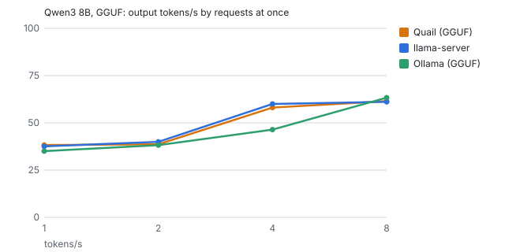

Engine-native ceiling (llama-batched-bench, no server): generated tokens/s by sequences at once: 1 → 46.4, 2 → 50.6, 4 → 85.1, 8 → 92.7.

#### MLX lane (same MLX folder)

Output tokens per second over each level (median across rounds), and time to first token (p50). Peak memory is the memory footprint macOS charges the server (Activity Monitor's Memory), GPU buffers included. A model file that an engine maps rather than loads isn't in it, so the llama.cpp engines read low by up to the file's size.

| Engine | 512x256-c1 | 512x256-c2 | 512x256-c4 | 512x256-c8 | 4096x128-c1 | Peak memory |
|---|---:|---:|---:|---:|---:|---:|
| Quail (MLX) | 43.0 (1,704 ms) | 46.8 (3,394 ms) | 49.2 (3,445 ms) | 43.8 (3,652 ms) | 7.7 (14,099 ms) | 30.3 GB |
| oMLX | 42.8 (1,943 ms) | 43.8 (2,824 ms) | 47.9 (3,159 ms) | 42.8 (3,567 ms) | 8.0 (13,730 ms) | 9.1 GB |
| Rapid-MLX | 45.7 (1,453 ms) | 51.1 (2,748 ms) | 54.2 (5,305 ms) | 54.5 (10,647 ms) | 9.7 (10,855 ms) | 19.4 GB |

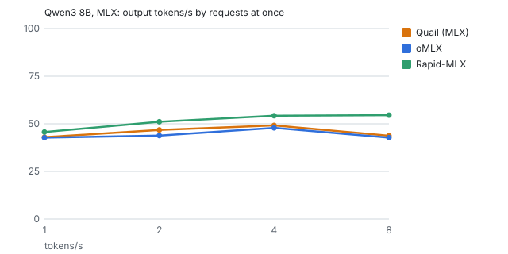

Engine-native ceiling (mlx_lm.benchmark, no server): generated tokens/s by sequences at once: 1 → 62.2, 2 → 69.8, 4 → 74.4, 8 → 64.6.

### Quality

#### GGUF lane (same .gguf file)

| Engine | GSM8K | MMLU-Pro |
|---|---:|---:|
| Quail (GGUF) | 90.7% (85%–94%, n=150) | 63.4% (54%–72%, n=112) |
| llama-server | 90.7% (85%–94%, n=150) | 61.6% (52%–70%, n=112) |
| Ollama (GGUF) | 90.7% (85%–94%, n=150) | 61.6% (52%–70%, n=112) |

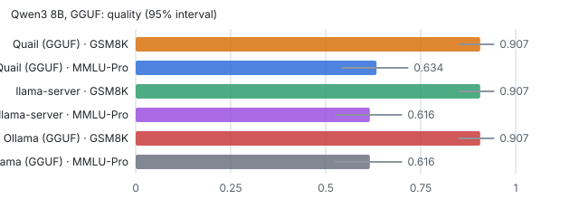

#### MLX lane (same MLX folder)

| Engine | GSM8K | MMLU-Pro |
|---|---:|---:|
| Quail (MLX) | 90.7% (85%–94%, n=150) | 63.4% (54%–72%, n=112) |
| oMLX | 90.7% (85%–94%, n=150) | 63.4% (54%–72%, n=112) |
| Rapid-MLX | 90.7% (85%–94%, n=150) | 60.7% (51%–69%, n=112) |

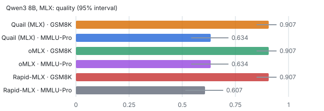

### Tool calling (BFCL)

#### GGUF lane (same .gguf file)

| Engine | simple python | multiple | parallel | parallel multiple | irrelevance |
|---|---:|---:|---:|---:|---:|
| Quail (GGUF) | 95.0% (83%–99%, n=40) | 92.5% (80%–97%, n=40) | 80.0% (65%–90%, n=40) | 85.0% (71%–93%, n=40) | 90.0% (77%–96%, n=40) |
| llama-server | 95.0% (83%–99%, n=40) | 92.5% (80%–97%, n=40) | 80.0% (65%–90%, n=40) | 85.0% (71%–93%, n=40) | 90.0% (77%–96%, n=40) |
| Ollama (GGUF) | 95.0% (83%–99%, n=40) | 90.0% (77%–96%, n=40) | 82.5% (68%–91%, n=40) | 87.5% (74%–95%, n=40) | 90.0% (77%–96%, n=40) |


#### MLX lane (same MLX folder)

| Engine | simple python | multiple | parallel | parallel multiple | irrelevance |
|---|---:|---:|---:|---:|---:|
| Quail (MLX) | 95.0% (83%–99%, n=40) | 92.5% (80%–97%, n=40) | 85.0% (71%–93%, n=40) | 87.5% (74%–95%, n=40) | 95.0% (83%–99%, n=40) |
| oMLX | 95.0% (83%–99%, n=40) | 92.5% (80%–97%, n=40) | 85.0% (71%–93%, n=40) | 87.5% (74%–95%, n=40) | 95.0% (83%–99%, n=40) |
| Rapid-MLX | 95.0% (83%–99%, n=40) | 92.5% (80%–97%, n=40) | 85.0% (71%–93%, n=40) | 87.5% (74%–95%, n=40) | 90.0% (77%–96%, n=40) |


## Qwen3.6 35B-A3B

### Speed

#### GGUF lane (same .gguf file)

Output tokens per second over each level (median across rounds), and time to first token (p50). Peak memory is the memory footprint macOS charges the server (Activity Monitor's Memory), GPU buffers included. A model file that an engine maps rather than loads isn't in it, so the llama.cpp engines read low by up to the file's size.

| Engine | 512x256-c1 | 512x256-c2 | 512x256-c4 | 512x256-c8 | 4096x128-c1 | Peak memory |
|---|---:|---:|---:|---:|---:|---:|
| Quail (GGUF) | 53.2 (687 ms) | 65.8 (1,434 ms) | 79.5 (2,030 ms) | 84.5 (4,487 ms) | 17.1 (5,271 ms) | 2.9 GB |
| llama-server | 53.9 (666 ms) | 68.4 (1,300 ms) | 82.8 (2,485 ms) | 85.7 (4,805 ms) | 18.5 (4,776 ms) | 11.8 GB |
| Ollama (GGUF) | 54.4 (634 ms) | 54.6 (5,306 ms) | 54.7 (14,656 ms) | 54.8 (33,320 ms) | 19.7 (4,347 ms) | 9.4 GB |

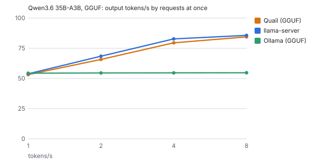

Engine-native ceiling (llama-batched-bench, no server): generated tokens/s by sequences at once: 1 → 60.9, 2 → 82.1, 4 → 106.2, 8 → 117.0.

#### MLX lane (same MLX folder)

Output tokens per second over each level (median across rounds), and time to first token (p50). Peak memory is the memory footprint macOS charges the server (Activity Monitor's Memory), GPU buffers included. A model file that an engine maps rather than loads isn't in it, so the llama.cpp engines read low by up to the file's size.

| Engine | 512x256-c1 | 512x256-c2 | 512x256-c4 | 512x256-c8 | 4096x128-c1 | Peak memory |
|---|---:|---:|---:|---:|---:|---:|
| Quail (MLX) | 49.0 (1,158 ms) | 58.1 (2,294 ms) | 69.7 (1,462 ms) | 76.7 (1,573 ms) | 12.6 (8,050 ms) | 28.0 GB |
| oMLX | 56.4 (1,253 ms) | 59.4 (2,220 ms) | 73.4 (2,251 ms) | 72.8 (2,494 ms) | 16.1 (6,300 ms) | 24.1 GB |
| Rapid-MLX | 63.8 (867 ms) | 76.3 (1,498 ms) | 91.7 (2,762 ms) | 104.8 (5,234 ms) | 18.8 (5,058 ms) | 23.8 GB |

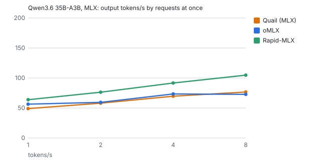

Engine-native ceiling (mlx_lm.benchmark, no server): generated tokens/s by sequences at once: 1 → 71.7, 2 → 95.7, 4 → 117.8, 8 → 132.2.

### Quality

#### GGUF lane (same .gguf file)

| Engine | GSM8K | MMLU-Pro |
|---|---:|---:|
| Quail (GGUF) | 96.0% (92%–98%, n=150) | 85.7% (78%–91%, n=112) |
| llama-server | 94.7% (90%–97%, n=150) | 83.0% (75%–89%, n=112) |
| Ollama (GGUF) | 94.7% (90%–97%, n=150) | 82.1% (74%–88%, n=112) |

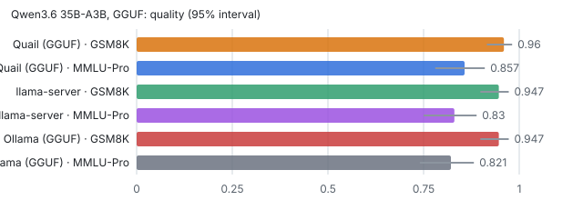

#### MLX lane (same MLX folder)

| Engine | GSM8K | MMLU-Pro |
|---|---:|---:|
| Quail (MLX) | 96.0% (92%–98%, n=150) | 80.4% (72%–87%, n=112) |
| oMLX | 92.0% (87%–95%, n=150) | 83.0% (75%–89%, n=112) |
| Rapid-MLX | 95.3% (91%–98%, n=150) | 78.6% (70%–85%, n=112) |

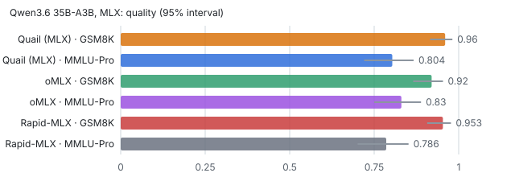

### Tool calling (BFCL)

#### GGUF lane (same .gguf file)

| Engine | simple python | multiple | parallel | parallel multiple | irrelevance |
|---|---:|---:|---:|---:|---:|
| Quail (GGUF) | 90.0% (77%–96%, n=40) | 87.5% (74%–95%, n=40) | 92.5% (80%–97%, n=40) | 95.0% (83%–99%, n=40) | 92.5% (80%–97%, n=40) |
| llama-server | 87.5% (74%–95%, n=40) | 85.0% (71%–93%, n=40) | 95.0% (83%–99%, n=40) | 95.0% (83%–99%, n=40) | 95.0% (83%–99%, n=40) |
| Ollama (GGUF) | 87.5% (74%–95%, n=40) | 85.0% (71%–93%, n=40) | 90.0% (77%–96%, n=40) | 92.5% (80%–97%, n=40) | 95.0% (83%–99%, n=40) |

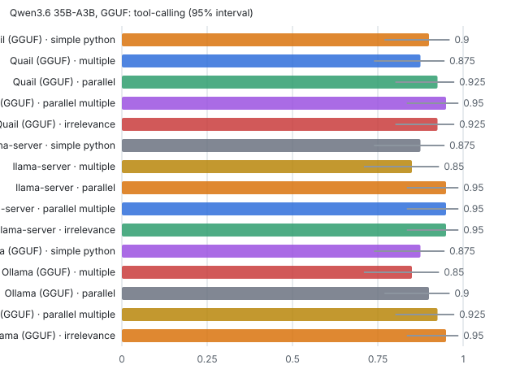

#### MLX lane (same MLX folder)

| Engine | simple python | multiple | parallel | parallel multiple | irrelevance |
|---|---:|---:|---:|---:|---:|
| Quail (MLX) | 92.5% (80%–97%, n=40) | 90.0% (77%–96%, n=40) | 95.0% (83%–99%, n=40) | 92.5% (80%–97%, n=40) | 90.0% (77%–96%, n=40) |
| oMLX | 92.5% (80%–97%, n=40) | 90.0% (77%–96%, n=40) | 92.5% (80%–97%, n=40) | 92.5% (80%–97%, n=40) | 87.5% (74%–95%, n=40) |
| Rapid-MLX | 7.5% (3%–20%, n=40) | 22.5% (12%–38%, n=40) | 15.0% (7%–29%, n=40) | 20.0% (10%–35%, n=40) | 97.5% (87%–100%, n=40) |

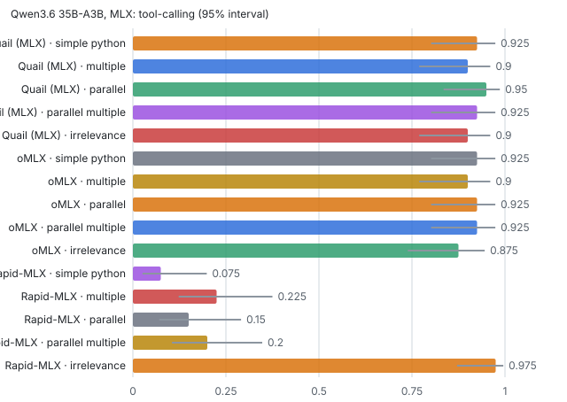

## Gemma 4 26B-A4B

### Speed

#### GGUF lane (same .gguf file)

Output tokens per second over each level (median across rounds), and time to first token (p50). Peak memory is the memory footprint macOS charges the server (Activity Monitor's Memory), GPU buffers included. A model file that an engine maps rather than loads isn't in it, so the llama.cpp engines read low by up to the file's size.

| Engine | 512x256-c1 | 512x256-c2 | 512x256-c4 | 512x256-c8 | 4096x128-c1 | Peak memory |
|---|---:|---:|---:|---:|---:|---:|
| Quail (GGUF) | 50.8 (725 ms) | 64.5 (1,497 ms) | 76.5 (2,085 ms) | 81.6 (4,574 ms) | 12.6 (7,770 ms) | 17.1 GB |
| llama-server | 51.4 (730 ms) | 65.8 (1,439 ms) | 79.6 (2,709 ms) | 80.4 (4,702 ms) | 15.1 (6,108 ms) | 15.8 GB |
| Ollama (GGUF) | 51.8 (690 ms) | 61.9 (1,274 ms) | 73.0 (2,546 ms) | 87.3 (4,992 ms) | 15.7 (5,888 ms) | 21.2 GB |

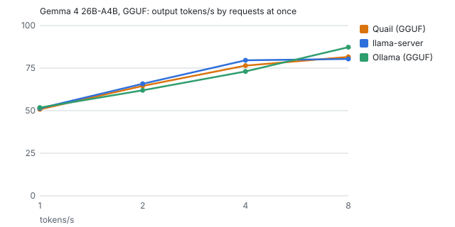

Engine-native ceiling (llama-batched-bench, no server): generated tokens/s by sequences at once: 1 → 59.0, 2 → 83.1, 4 → 108.6, 8 → 120.2.

#### MLX lane (same MLX folder)

Output tokens per second over each level (median across rounds), and time to first token (p50). Peak memory is the memory footprint macOS charges the server (Activity Monitor's Memory), GPU buffers included. A model file that an engine maps rather than loads isn't in it, so the llama.cpp engines read low by up to the file's size.

| Engine | 512x256-c1 | 512x256-c2 | 512x256-c4 | 512x256-c8 | 4096x128-c1 | Peak memory |
|---|---:|---:|---:|---:|---:|---:|
| Quail (MLX) | 44.7 (1,288 ms) | 44.7 (6,984 ms) | 45.1 (18,252 ms) | 44.9 (40,979 ms) | 11.5 (8,784 ms) | 25.7 GB |
| oMLX | 45.3 (1,400 ms) | 51.6 (2,394 ms) | 58.3 (2,388 ms) | 59.1 (3,100 ms) | 11.6 (8,893 ms) | 19.6 GB |
| Rapid-MLX | 51.8 (936 ms) | 63.3 (1,642 ms) | 72.8 (3,086 ms) | 83.8 (5,770 ms) | 15.4 (6,172 ms) | 28.9 GB |

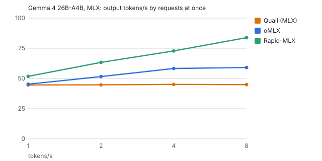

Engine-native ceiling (mlx_lm.benchmark, no server): generated tokens/s by sequences at once: 1 → 58.6, 2 → 76.5, 4 → 91.0, 8 → 101.8.

### Quality

#### GGUF lane (same .gguf file)

| Engine | GSM8K | MMLU-Pro |
|---|---:|---:|
| Quail (GGUF) | 94.7% (90%–97%, n=150) | 84.8% (77%–90%, n=112) |
| llama-server | 94.7% (90%–97%, n=150) | 89.3% (82%–94%, n=112) |
| Ollama (GGUF) | 94.7% (90%–97%, n=150) | 89.3% (82%–94%, n=112) |

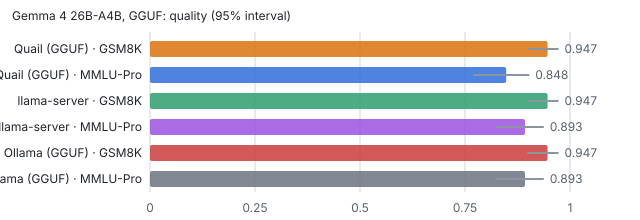

#### MLX lane (same MLX folder)

| Engine | GSM8K | MMLU-Pro |
|---|---:|---:|
| Quail (MLX) | 87.3% (81%–92%, n=150) | 85.7% (78%–91%, n=112) |
| oMLX | 92.7% (87%–96%, n=150) | 85.7% (78%–91%, n=112) |
| Rapid-MLX | 90.0% (84%–94%, n=150) | 84.8% (77%–90%, n=112) |

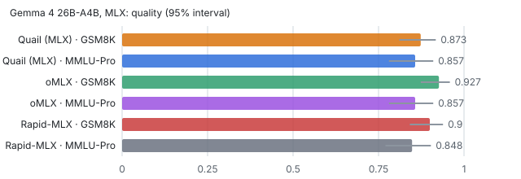

### Tool calling (BFCL)

#### GGUF lane (same .gguf file)

| Engine | simple python | multiple | parallel | parallel multiple | irrelevance |
|---|---:|---:|---:|---:|---:|
| Quail (GGUF) | 97.5% (87%–100%, n=40) | 92.5% (80%–97%, n=40) | 85.0% (71%–93%, n=40) | 85.0% (71%–93%, n=40) | 90.0% (77%–96%, n=40) |
| llama-server | 97.5% (87%–100%, n=40) | 92.5% (80%–97%, n=40) | 85.0% (71%–93%, n=40) | 85.0% (71%–93%, n=40) | 90.0% (77%–96%, n=40) |
| Ollama (GGUF) | 97.5% (87%–100%, n=40) | 92.5% (80%–97%, n=40) | 82.5% (68%–91%, n=40) | 85.0% (71%–93%, n=40) | 90.0% (77%–96%, n=40) |


#### MLX lane (same MLX folder)

| Engine | simple python | multiple | parallel | parallel multiple | irrelevance |
|---|---:|---:|---:|---:|---:|
| Quail (MLX) | 97.5% (87%–100%, n=40) | 92.5% (80%–97%, n=40) | 82.5% (68%–91%, n=40) | 85.0% (71%–93%, n=40) | 90.0% (77%–96%, n=40) |
| oMLX | 97.5% (87%–100%, n=40) | 92.5% (80%–97%, n=40) | 82.5% (68%–91%, n=40) | 85.0% (71%–93%, n=40) | 87.5% (74%–95%, n=40) |
| Rapid-MLX | 0.0% (0%–9%, n=40) | 0.0% (0%–9%, n=40) | 0.0% (0%–9%, n=40) | 0.0% (0%–9%, n=40) | 100.0% (91%–100%, n=40) |

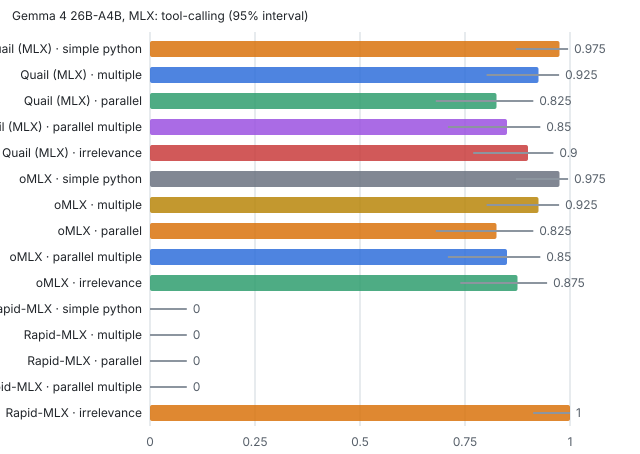

## Where Quail is slower or worse

Each cell names the engines that did better than Quail at that level, and by how much, as a share of Quail's figure: higher throughput, or shorter times. Only gaps of more than 5% and more than the spread between rounds count (D-063). Time between tokens is only compared with one request at a time.

#### Qwen3 8B, GGUF lane

| Level | Throughput | Time to first token |
|---|---|---|
| 4096x128-c1 | llama-server 9% | llama-server 10% |

#### Qwen3 8B, MLX lane

| Level | Throughput | Time to first token | Time between tokens |
|---|---|---|---|
| 512x256-c1 | Rapid-MLX 6% | Rapid-MLX 15% | — |
| 512x256-c2 | Rapid-MLX 9% | Rapid-MLX 19%, oMLX 17% | — |
| 512x256-c4 | Rapid-MLX 10% | oMLX 8% | — |
| 512x256-c8 | Rapid-MLX 25% | — | — |
| 4096x128-c1 | Rapid-MLX 26% | Rapid-MLX 23% | oMLX 5% |

#### Qwen3.6 35B-A3B, GGUF lane

| Level | Throughput | Time to first token |
|---|---|---|
| 512x256-c1 | — | Ollama (GGUF) 8% |
| 512x256-c2 | — | llama-server 9% |
| 4096x128-c1 | Ollama (GGUF) 15%, llama-server 8% | Ollama (GGUF) 18%, llama-server 9% |

#### Qwen3.6 35B-A3B, MLX lane

| Level | Throughput | Time to first token | Time between tokens |
|---|---|---|---|
| 512x256-c1 | Rapid-MLX 30%, oMLX 15% | Rapid-MLX 25% | Rapid-MLX 23%, oMLX 19% |
| 512x256-c2 | Rapid-MLX 31% | Rapid-MLX 35% | — |
| 512x256-c4 | Rapid-MLX 32%, oMLX 5% | — | — |
| 512x256-c8 | Rapid-MLX 37% | — | — |
| 4096x128-c1 | Rapid-MLX 50%, oMLX 28% | Rapid-MLX 37%, oMLX 22% | oMLX 21%, Rapid-MLX 18% |

#### Gemma 4 26B-A4B, GGUF lane

| Level | Throughput | Time to first token |
|---|---|---|
| 512x256-c2 | — | Ollama (GGUF) 15% |
| 512x256-c8 | Ollama (GGUF) 7% | — |
| 4096x128-c1 | Ollama (GGUF) 24%, llama-server 20% | Ollama (GGUF) 24%, llama-server 21% |

#### Gemma 4 26B-A4B, MLX lane

| Level | Throughput | Time to first token | Time between tokens |
|---|---|---|---|
| 512x256-c1 | Rapid-MLX 16% | Rapid-MLX 27% | Rapid-MLX 9% |
| 512x256-c2 | Rapid-MLX 42%, oMLX 15% | Rapid-MLX 76%, oMLX 66% | — |
| 512x256-c4 | Rapid-MLX 62%, oMLX 29% | oMLX 87%, Rapid-MLX 83% | — |
| 512x256-c8 | Rapid-MLX 87%, oMLX 32% | oMLX 92%, Rapid-MLX 86% | — |
| 4096x128-c1 | Rapid-MLX 34% | Rapid-MLX 30% | Rapid-MLX 7% |

## Caveats

- Ollama (GGUF) ignores `ignore_eos`, so its replies' lengths were held by the prompts — Qwen3 8B, Qwen3.6 35B-A3B, Gemma 4 26B-A4B.
- oMLX ignores `ignore_eos`, so its replies' lengths were held by the prompts — Qwen3 8B, Qwen3.6 35B-A3B, Gemma 4 26B-A4B.
- Rapid-MLX ignores `ignore_eos`, so its replies' lengths were held by the prompts — Qwen3 8B, Qwen3.6 35B-A3B, Gemma 4 26B-A4B.
- Rapid-MLX didn't return a parsed tool call on /v1/chat/completions — Gemma 4 26B-A4B.
- Rapid-MLX didn't return a tool_use block on /v1/messages — Gemma 4 26B-A4B.
- Ollama (MLX) couldn't start: mlx runner failed: panic: mlx: [dequantize] Invalid quantization mode ''. at /Users/runner/work/ollama/ollama/build/darwin-sources/_deps/mlx-c-src/mlx/c/ops.… — Qwen3 8B.
- Ollama (MLX) couldn't start: mlx runner failed: panic: mlx: [quantized_matmul] The shapes of the weight and scales are incompatible based on bits and group_size. w.shape() == (256,512) a… — Qwen3.6 35B-A3B.
- Ollama (MLX) couldn't start: mlx runner failed: Error: layer 0: missing MoE expert weights (exit: exit status 1) — Gemma 4 26B-A4B.
- Ollama (GGUF) served one request at a time; its log says the "model architecture does not currently support parallel requests" — Qwen3.6 35B-A3B.
- Rapid-MLX asked for 2 of 262 quality requests to be sent again later (429 or 503 with Retry-After); they were, as a client would — Gemma 4 26B-A4B.
- Rapid-MLX refused 13 of 275 quality requests (HTTP 503: The model ran out of memory during generation. Free up memory or choose a smaller model.) — Qwen3 8B.
- Rapid-MLX asked for 14 of 275 quality requests to be sent again later (429 or 503 with Retry-After); they were, as a client would — Qwen3 8B.
- Rapid-MLX refused 4 of 204 BFCL requests (HTTP 503: The model ran out of memory during generation. Free up memory or choose a smaller model.) — Gemma 4 26B-A4B.
- Rapid-MLX asked for 37 of 204 BFCL requests to be sent again later (429 or 503 with Retry-After); they were, as a client would — Gemma 4 26B-A4B.
- Rapid-MLX refused 3 of 200 BFCL requests (HTTP 400: Tool call 'calculate_projectile_range' parameter 'initial_velocity' violates declared schema: Expected number, got str. The model produced a schema-violating…) — Qwen3 8B.
- Rapid-MLX asked for 1 of 200 BFCL requests to be sent again later (429 or 503 with Retry-After); they were, as a client would — Qwen3 8B.
- Rapid-MLX refused 133 of 200 BFCL requests (HTTP 400: Tool call 'calculate_heat' parameter 'mass' violates declared schema: Expected number, got str. The model produced a schema-violating argument value; retry w…) — Qwen3.6 35B-A3B.
- Qwen3.6's chat template: llama-server and Ollama render each earlier assistant turn with 4 more tokens than Quail, oMLX and Rapid-MLX, which agree with each other. It only touches the few-shot quality prompts.
- Rapid-MLX turns on its own GPU kernels as it loads a model: for Qwen3.6, a blocked GatedDeltaNet prefill kernel, a fused GatedDeltaNet decode and a compiled single-request decode. It also caps MLX's buffer cache (12.5 GB on this Mac). oMLX applies its own patches for the Qwen3.5 family, including a GatedDeltaNet prefill kernel and quantized-MLP prefill. They're part of each engine as shipped, so they were left on.
- Neither oMLX nor Rapid-MLX used speculative decoding here. Rapid-MLX's log says "spec decode OFF" for Qwen3.6, and oMLX skipped MTP because the checkpoint has no MTP weights. Rapid-MLX's TurboQuant KV cache and prompt compression, and oMLX's TurboQuant KV, were switched off to hold every engine to a full-precision cache.

## Reproducing it

This report is the run `20260929-022439-compare` with the smoke test `20260929-021845-smoke`, by the harness at commit `ac5e758`, with Quail 0.58.1. A run on another Mac gets folders named for the time it started.

What it needs (`bench/README.md` has the details):

- A Release build of Quail, in `/Applications` or from `task install`. The harness runs the app's own `quail-server` and `llama-server`, not the app.
- The models in Quail's store, as a GGUF file and an MLX folder each (`bench/config/models.toml`). `task bench:doctor` says which are missing.
- `uv` and Rapid-MLX (`brew install uv rapid-mlx`). `task bench:setup` fetches the rest: oMLX, Ollama, llama.cpp's tools, GuideLLM, mlx-lm, lm-eval and BFCL, at pinned versions.
- Passwordless `sudo` for `/usr/bin/powermetrics` and `/usr/bin/mdutil`: the thermal gate and pausing Spotlight. Without it the run goes on, and records that it couldn't.
- Mains power, about 100 GB free, and no other LLM server running. A timed run refuses to start otherwise.

```
task bench:setup
task bench:smoke
task bench:compare BUDGET=night
task bench:report RUN=<the compare run's folder> SMOKE=<the smoke run's folder>
```

`BUDGET=night` is 2 speed rounds of 6 requests per stream at each level; the first 150 GSM8K items, the first 8 MMLU-Pro items per subject and the first 40 BFCL cases per category.
