# Quail against llama-server, Ollama, oMLX and Rapid-MLX — 2026-09-30

Measured by the comparison harness in `bench/` (ADR D-063): the same weights in every engine of a lane, the same prompts, the same settings, one server at a time.

## What we found

**What changed since the [2026-09-29 run](../2026-09-29/).** The same Mac, models and harness. Quail went from 0.58.1 to 0.61.6 on the GGUF lane and 0.62.0 on the MLX lane. Six fixes landed in between, each from that run's findings.

| Where | Before | Now | Fix |
|---|---:|---:|---|
| Gemma 4, MLX, 8 at once: first token | 41.0 s | **1.6 s** | Batched decoding for Gemma 4, [#140](https://github.com/adatoo/quail/issues/140) |
| Gemma 4, MLX, 8 at once: throughput | 44.9 tok/s | **68.1 tok/s** | [#140](https://github.com/adatoo/quail/issues/140) |
| Qwen3 8B, MLX, 8 at once: throughput | 43.8 tok/s | **49.8 tok/s** | MLX 0.32, prompt slicing, [#139](https://github.com/adatoo/quail/issues/139) |
| Qwen3.6, MLX, 8 at once: throughput | 76.7 tok/s | **88.0 tok/s** | [#139](https://github.com/adatoo/quail/issues/139) |
| Qwen3.6, MLX, one request: time between tokens | 15.8 ms | **13.1 ms** | Quail's own model code and a fused GPU kernel, [#141](https://github.com/adatoo/quail/issues/141) |
| Qwen3.6, MLX, 4,096-token prompt: first token | 8.0 s | **5.2 s** | [#139](https://github.com/adatoo/quail/issues/139), [#141](https://github.com/adatoo/quail/issues/141) |
| Qwen3 8B, MLX: peak memory at 4,096 tokens | 32.5 GB | **10.4 GB** | MLX's buffer cache capped, [#137](https://github.com/adatoo/quail/issues/137) |
| Gemma 4, GGUF, 4,096-token prompt: first token | 7.8 s | **6.0 s** (llama-server 6.1 s) | Idle requests' caches moved out of the way, [#138](https://github.com/adatoo/quail/issues/138) |

The other engines measured within 8% of their first run, most within 2%, so the changes are Quail's.

**GGUF lane (llama.cpp): level with llama-server.**
- Long prompts no longer lag. On 4,096-token prompts, Quail's first token takes 10.0 s against llama-server's 9.5 s on Qwen3 8B, 4.8 s against 4.8 s on Qwen3.6, and 6.0 s against 6.1 s on Gemma 4.
- From 4 requests at once, Quail's first token still comes sooner than llama-server's on every model.

**MLX lane: Quail now leads on first tokens, and trails Rapid-MLX on throughput with several requests at once.**
- **First token, with 4 and 8 requests at once:** Quail is fastest of the three on every model. At 8 at once:

  | Model | Quail | oMLX | Rapid-MLX |
  |---|---:|---:|---:|
  | Qwen3 8B | 3.0 s | 3.6 s | 10.7 s |
  | Qwen3.6 | 1.3 s | 2.5 s | 5.7 s |
  | Gemma 4 | 1.6 s | 3.0 s | 6.0 s |
- **4,096-token prompts:** Quail is fastest on Qwen3.6, at 5.2 s. It's within about 2% of Rapid-MLX on Qwen3 8B and Gemma 4, and ahead of oMLX on all three.
- **Throughput with 2 to 8 at once:** Rapid-MLX makes 10–20% more tokens a second. At 8 at once:
  - Qwen3 8B: 49.8 against 54.7;
  - Qwen3.6: 88.0 against 101.3;
  - Gemma 4: 68.1 against 81.6.

  Quail is ahead of oMLX at 8 at once on all three.
- **One request:** Rapid-MLX is 7–10% faster on Qwen3.6 and Gemma 4. Rapid-MLX compiles its whole single-request step and fuses more of the model's work into single GPU kernels. [#141](https://github.com/adatoo/quail/issues/141) stays open for that.
- **Memory:** Quail's peak is now below Rapid-MLX's on every model, for example 11.7 GB against 20.7 GB on Qwen3 8B. oMLX uses less than Quail on Qwen3 8B and Gemma 4.

**Quality and tool calling: the same as the other engines, except Gemma 4.**
- On Gemma 4, Quail scored a few points lower in both runs and on both lanes: MMLU-Pro on GGUF (85.7% against 90.2% and 91.1%) and GSM8K on MLX (84.7% against 89.3% and 90.0%). Only one comparison is significant on its own: Ollama (GGUF) on MMLU-Pro, 6 items to 0, p = 0.031. Because it shows on both lanes and only for Gemma 4, the likely cause is Quail's own rendering of Gemma 4's chat template. It's being checked in [#152](https://github.com/adatoo/quail/issues/152).
- Qwen3 8B and Qwen3.6 show no significant difference on either lane.

**Where the others fell short:**
- Rapid-MLX refused 133 of Qwen3.6's 200 tool-calling requests with HTTP 400. It rejected the model's arguments as the wrong type: a string where the schema wanted a number.
- Rapid-MLX returned no Gemma 4 tool calls at all.
- Ollama's MLX runner couldn't load any of the three models.
- Ollama serves Qwen3.6 one request at a time.

## The Mac

Apple M1 Max (MacBookPro18,2), 64 GB, macOS 27.0.1, on AC power. Thermal state at the start: Nominal.

## Versions

| Engine | Version |
|---|---|
| Quail (GGUF) | 0.61.6 |
| llama-server | 0.4.1-dev (build 11081, commit 161755f29) |
| Ollama (GGUF) | 0.34.4 |
| Quail (MLX) | 0.62.0 |
| oMLX | 0.6.4 |
| Rapid-MLX | 0.15.2 |
| Ollama (MLX) | 0.34.4 |

## Settings every engine is held to

8 slots of 8,192 tokens; full-precision KV cache; temperature 0.0, seed 42, penalties 0; thinking off. The whole file is in `raw/fairness.toml`.

Speed levels are named for their prompt and reply lengths and how many requests are sent at once: `512x256-c8` is 512-token prompts, 256-token replies, 8 at once.

## Qwen3 8B

### Speed

#### GGUF lane (same .gguf file)

Output tokens per second over each level (median across rounds), and time to first token (p50). Peak memory is the memory footprint macOS charges the server (Activity Monitor's Memory), GPU buffers included. A model file that an engine maps rather than loads isn't in it, so the llama.cpp engines read low by up to the file's size.

| Engine | 512x256-c1 | 512x256-c2 | 512x256-c4 | 512x256-c8 | 4096x128-c1 | Peak memory |
|---|---:|---:|---:|---:|---:|---:|
| Quail (GGUF) | 38.9 (1,108 ms) | 36.6 (2,246 ms) | 55.7 (3,012 ms) | 55.7 (6,079 ms) | 9.8 (9,975 ms) | 20.3 GB |
| llama-server | 34.5 (1,355 ms) | 38.6 (2,302 ms) | 57.1 (4,496 ms) | 57.8 (7,912 ms) | 10.1 (9,475 ms) | 20.2 GB |
| Ollama (GGUF) | 37.4 (1,140 ms) | 38.7 (2,225 ms) | 43.4 (5,090 ms) | 60.0 (8,658 ms) | 9.4 (10,465 ms) | 20.3 GB |

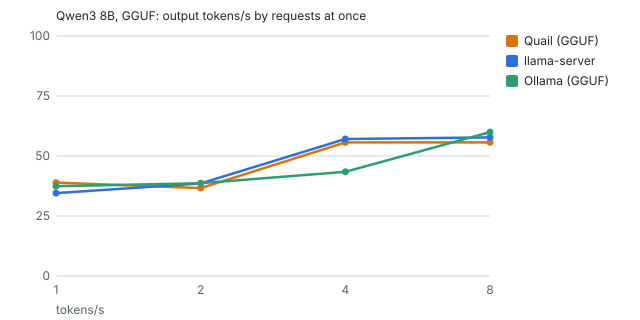

Engine-native ceiling (llama-batched-bench, no server): generated tokens/s by sequences at once: 1 → 46.4, 2 → 50.6, 4 → 85.1, 8 → 92.8.

#### MLX lane (same MLX folder)

Output tokens per second over each level (median across rounds), and time to first token (p50). Peak memory is the memory footprint macOS charges the server (Activity Monitor's Memory), GPU buffers included. A model file that an engine maps rather than loads isn't in it, so the llama.cpp engines read low by up to the file's size.

| Engine | 512x256-c1 | 512x256-c2 | 512x256-c4 | 512x256-c8 | 4096x128-c1 | Peak memory |
|---|---:|---:|---:|---:|---:|---:|
| Quail (MLX) | 44.9 (1,439 ms) | 45.9 (2,763 ms) | 47.9 (2,812 ms) | 49.8 (2,976 ms) | 9.6 (10,959 ms) | 11.7 GB |
| oMLX | 42.5 (1,953 ms) | 43.9 (2,837 ms) | 47.9 (3,076 ms) | 42.3 (3,596 ms) | 8.0 (13,748 ms) | 9.1 GB |
| Rapid-MLX | 45.9 (1,434 ms) | 51.2 (2,741 ms) | 54.3 (5,293 ms) | 54.7 (10,672 ms) | 9.7 (10,861 ms) | 20.7 GB |

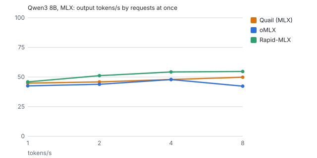

Engine-native ceiling (mlx_lm.benchmark, no server): generated tokens/s by sequences at once: 1 → 62.3, 2 → 70.4, 4 → 75.2, 8 → 65.0.

### Quality

#### GGUF lane (same .gguf file)

| Engine | GSM8K | MMLU-Pro |
|---|---:|---:|
| Quail (GGUF) | 90.7% (85%–94%, n=150) | 62.5% (53%–71%, n=112) |
| llama-server | 90.7% (85%–94%, n=150) | 61.6% (52%–70%, n=112) |
| Ollama (GGUF) | 90.7% (85%–94%, n=150) | 63.4% (54%–72%, n=112) |

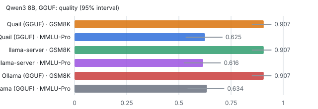

#### MLX lane (same MLX folder)

| Engine | GSM8K | MMLU-Pro |
|---|---:|---:|
| Quail (MLX) | 89.3% (83%–93%, n=150) | 62.5% (53%–71%, n=112) |
| oMLX | 88.7% (83%–93%, n=150) | 64.3% (55%–73%, n=112) |
| Rapid-MLX | 90.7% (85%–94%, n=150) | 61.6% (52%–70%, n=112) |

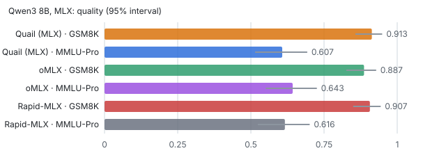

### Tool calling (BFCL)

#### GGUF lane (same .gguf file)

| Engine | simple python | multiple | parallel | parallel multiple | irrelevance |
|---|---:|---:|---:|---:|---:|
| Quail (GGUF) | 95.0% (83%–99%, n=40) | 92.5% (80%–97%, n=40) | 80.0% (65%–90%, n=40) | 85.0% (71%–93%, n=40) | 90.0% (77%–96%, n=40) |
| llama-server | 95.0% (83%–99%, n=40) | 92.5% (80%–97%, n=40) | 80.0% (65%–90%, n=40) | 85.0% (71%–93%, n=40) | 90.0% (77%–96%, n=40) |
| Ollama (GGUF) | 95.0% (83%–99%, n=40) | 90.0% (77%–96%, n=40) | 82.5% (68%–91%, n=40) | 87.5% (74%–95%, n=40) | 90.0% (77%–96%, n=40) |

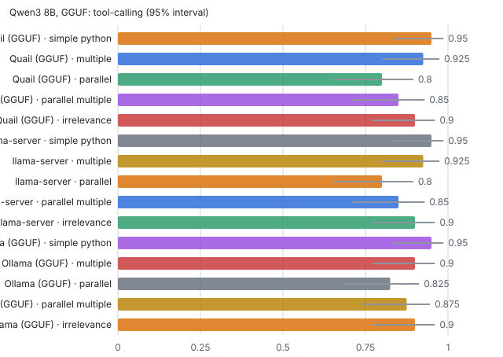

#### MLX lane (same MLX folder)

| Engine | simple python | multiple | parallel | parallel multiple | irrelevance |
|---|---:|---:|---:|---:|---:|
| Quail (MLX) | 95.0% (83%–99%, n=40) | 92.5% (80%–97%, n=40) | 85.0% (71%–93%, n=40) | 87.5% (74%–95%, n=40) | 95.0% (83%–99%, n=40) |
| oMLX | 95.0% (83%–99%, n=40) | 92.5% (80%–97%, n=40) | 85.0% (71%–93%, n=40) | 87.5% (74%–95%, n=40) | 95.0% (83%–99%, n=40) |
| Rapid-MLX | 95.0% (83%–99%, n=40) | 92.5% (80%–97%, n=40) | 85.0% (71%–93%, n=40) | 87.5% (74%–95%, n=40) | 90.0% (77%–96%, n=40) |

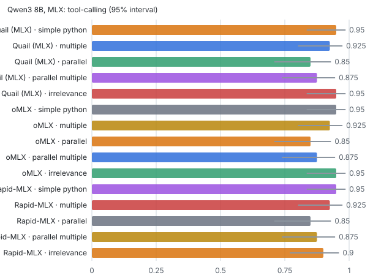

## Qwen3.6 35B-A3B

### Speed

#### GGUF lane (same .gguf file)

Output tokens per second over each level (median across rounds), and time to first token (p50). Peak memory is the memory footprint macOS charges the server (Activity Monitor's Memory), GPU buffers included. A model file that an engine maps rather than loads isn't in it, so the llama.cpp engines read low by up to the file's size.

| Engine | 512x256-c1 | 512x256-c2 | 512x256-c4 | 512x256-c8 | 4096x128-c1 | Peak memory |
|---|---:|---:|---:|---:|---:|---:|
| Quail (GGUF) | 53.8 (690 ms) | 67.3 (1,419 ms) | 79.8 (2,047 ms) | 84.3 (4,600 ms) | 18.3 (4,795 ms) | 11.4 GB |
| llama-server | 54.0 (667 ms) | 68.5 (1,301 ms) | 82.9 (2,476 ms) | 85.6 (4,809 ms) | 18.5 (4,778 ms) | 11.8 GB |
| Ollama (GGUF) | 54.7 (634 ms) | 54.9 (5,279 ms) | 54.2 (14,593 ms) | 54.5 (33,260 ms) | 19.8 (4,346 ms) | 9.4 GB |

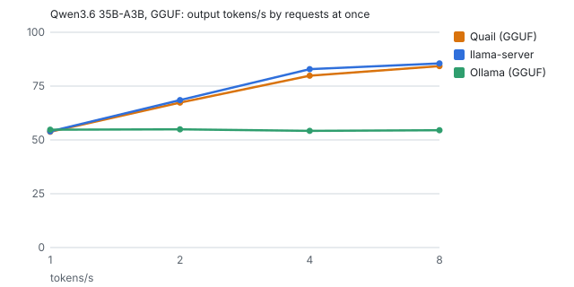

Engine-native ceiling (llama-batched-bench, no server): generated tokens/s by sequences at once: 1 → 60.9, 2 → 82.2, 4 → 106.3, 8 → 117.1.

#### MLX lane (same MLX folder)

Output tokens per second over each level (median across rounds), and time to first token (p50). Peak memory is the memory footprint macOS charges the server (Activity Monitor's Memory), GPU buffers included. A model file that an engine maps rather than loads isn't in it, so the llama.cpp engines read low by up to the file's size.

| Engine | 512x256-c1 | 512x256-c2 | 512x256-c4 | 512x256-c8 | 4096x128-c1 | Peak memory |
|---|---:|---:|---:|---:|---:|---:|
| Quail (MLX) | 59.8 (884 ms) | 64.1 (1,751 ms) | 76.2 (1,185 ms) | 88.0 (1,298 ms) | 18.4 (5,157 ms) | 23.7 GB |
| oMLX | 56.7 (1,248 ms) | 60.6 (2,246 ms) | 71.7 (2,354 ms) | 72.2 (2,461 ms) | 16.0 (6,302 ms) | 24.1 GB |
| Rapid-MLX | 63.7 (870 ms) | 76.3 (1,506 ms) | 91.7 (2,788 ms) | 101.3 (5,663 ms) | 18.0 (5,355 ms) | 23.9 GB |

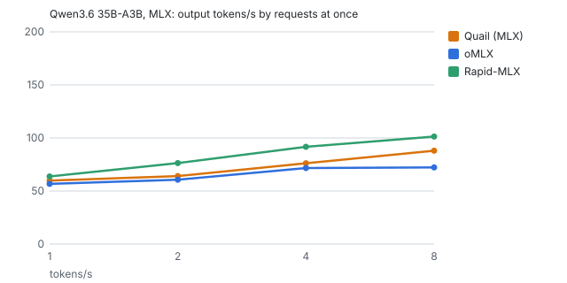

Engine-native ceiling (mlx_lm.benchmark, no server): generated tokens/s by sequences at once: 1 → 72.3, 2 → 95.4, 4 → 118.0, 8 → 133.9.

### Quality

#### GGUF lane (same .gguf file)

| Engine | GSM8K | MMLU-Pro |
|---|---:|---:|
| Quail (GGUF) | 96.0% (92%–98%, n=150) | 82.1% (74%–88%, n=112) |
| llama-server | 95.3% (91%–98%, n=150) | 80.4% (72%–87%, n=112) |
| Ollama (GGUF) | 94.7% (90%–97%, n=150) | 82.1% (74%–88%, n=112) |

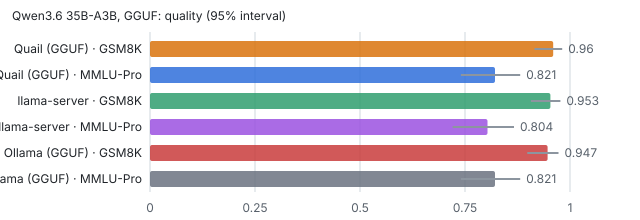

#### MLX lane (same MLX folder)

| Engine | GSM8K | MMLU-Pro |
|---|---:|---:|
| Quail (MLX) | 96.0% (92%–98%, n=150) | 79.5% (71%–86%, n=112) |
| oMLX | 94.0% (89%–97%, n=150) | 82.1% (74%–88%, n=112) |
| Rapid-MLX | 95.3% (91%–98%, n=150) | 78.6% (70%–85%, n=112) |

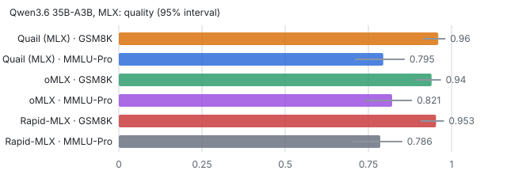

### Tool calling (BFCL)

#### GGUF lane (same .gguf file)

| Engine | simple python | multiple | parallel | parallel multiple | irrelevance |
|---|---:|---:|---:|---:|---:|
| Quail (GGUF) | 90.0% (77%–96%, n=40) | 87.5% (74%–95%, n=40) | 92.5% (80%–97%, n=40) | 95.0% (83%–99%, n=40) | 95.0% (83%–99%, n=40) |
| llama-server | 87.5% (74%–95%, n=40) | 85.0% (71%–93%, n=40) | 92.5% (80%–97%, n=40) | 95.0% (83%–99%, n=40) | 95.0% (83%–99%, n=40) |
| Ollama (GGUF) | 87.5% (74%–95%, n=40) | 85.0% (71%–93%, n=40) | 90.0% (77%–96%, n=40) | 92.5% (80%–97%, n=40) | 95.0% (83%–99%, n=40) |

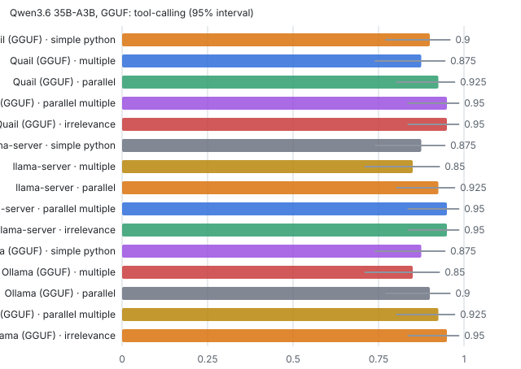

#### MLX lane (same MLX folder)

| Engine | simple python | multiple | parallel | parallel multiple | irrelevance |
|---|---:|---:|---:|---:|---:|
| Quail (MLX) | 92.5% (80%–97%, n=40) | 90.0% (77%–96%, n=40) | 92.5% (80%–97%, n=40) | 92.5% (80%–97%, n=40) | 92.5% (80%–97%, n=40) |
| oMLX | 92.5% (80%–97%, n=40) | 90.0% (77%–96%, n=40) | 92.5% (80%–97%, n=40) | 92.5% (80%–97%, n=40) | 87.5% (74%–95%, n=40) |
| Rapid-MLX | 7.5% (3%–20%, n=40) | 22.5% (12%–38%, n=40) | 15.0% (7%–29%, n=40) | 20.0% (10%–35%, n=40) | 97.5% (87%–100%, n=40) |

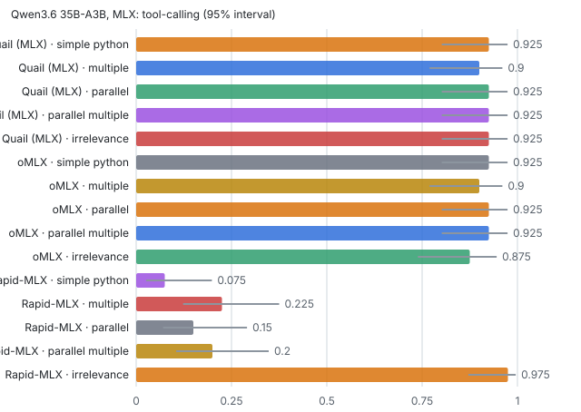

## Gemma 4 26B-A4B

### Speed

#### GGUF lane (same .gguf file)

Output tokens per second over each level (median across rounds), and time to first token (p50). Peak memory is the memory footprint macOS charges the server (Activity Monitor's Memory), GPU buffers included. A model file that an engine maps rather than loads isn't in it, so the llama.cpp engines read low by up to the file's size.

| Engine | 512x256-c1 | 512x256-c2 | 512x256-c4 | 512x256-c8 | 4096x128-c1 | Peak memory |
|---|---:|---:|---:|---:|---:|---:|
| Quail (GGUF) | 52.3 (692 ms) | 67.7 (1,414 ms) | 81.4 (1,990 ms) | 82.9 (4,141 ms) | 15.5 (5,982 ms) | 23.8 GB |
| llama-server | 50.2 (777 ms) | 65.8 (1,441 ms) | 79.4 (2,730 ms) | 78.8 (4,839 ms) | 15.2 (6,105 ms) | 15.1 GB |
| Ollama (GGUF) | 50.3 (726 ms) | 60.3 (1,321 ms) | 70.1 (2,556 ms) | 81.3 (5,386 ms) | 15.3 (6,081 ms) | 21.2 GB |

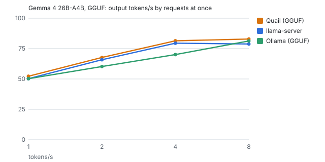

Engine-native ceiling (llama-batched-bench, no server): generated tokens/s by sequences at once: 1 → 59.1, 2 → 81.8, 4 → 107.5, 8 → 115.6.

#### MLX lane (same MLX folder)

Output tokens per second over each level (median across rounds), and time to first token (p50). Peak memory is the memory footprint macOS charges the server (Activity Monitor's Memory), GPU buffers included. A model file that an engine maps rather than loads isn't in it, so the llama.cpp engines read low by up to the file's size.

| Engine | 512x256-c1 | 512x256-c2 | 512x256-c4 | 512x256-c8 | 4096x128-c1 | Peak memory |
|---|---:|---:|---:|---:|---:|---:|
| Quail (MLX) | 47.3 (1,022 ms) | 53.4 (2,032 ms) | 60.8 (1,453 ms) | 68.1 (1,638 ms) | 14.8 (6,321 ms) | 24.5 GB |
| oMLX | 45.2 (1,395 ms) | 51.6 (2,429 ms) | 58.2 (2,367 ms) | 61.0 (2,952 ms) | 11.7 (8,724 ms) | 19.3 GB |
| Rapid-MLX | 51.8 (939 ms) | 63.5 (1,660 ms) | 72.8 (3,107 ms) | 81.6 (6,026 ms) | 15.3 (6,186 ms) | 28.9 GB |

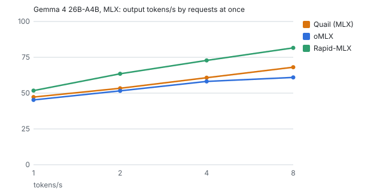

Engine-native ceiling (mlx_lm.benchmark, no server): generated tokens/s by sequences at once: 1 → 60.0, 2 → 78.1, 4 → 92.3, 8 → 105.2.

### Quality

#### GGUF lane (same .gguf file)

| Engine | GSM8K | MMLU-Pro |
|---|---:|---:|
| Quail (GGUF) | 96.0% (92%–98%, n=150) | 85.7% (78%–91%, n=112) |
| llama-server | 95.3% (91%–98%, n=150) | 90.2% (83%–94%, n=112) |
| Ollama (GGUF) | 95.3% (91%–98%, n=150) | 91.1% (84%–95%, n=112) |

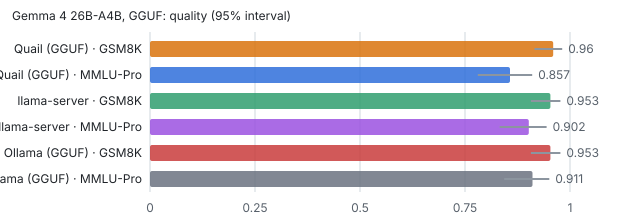

#### MLX lane (same MLX folder)

| Engine | GSM8K | MMLU-Pro |
|---|---:|---:|
| Quail (MLX) | 84.7% (78%–90%, n=150) | 83.9% (76%–90%, n=112) |
| oMLX | 89.3% (83%–93%, n=150) | 84.8% (77%–90%, n=112) |
| Rapid-MLX | 90.0% (84%–94%, n=150) | 84.8% (77%–90%, n=112) |

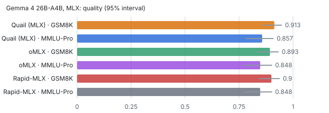

### Tool calling (BFCL)

#### GGUF lane (same .gguf file)

| Engine | simple python | multiple | parallel | parallel multiple | irrelevance |
|---|---:|---:|---:|---:|---:|
| Quail (GGUF) | 97.5% (87%–100%, n=40) | 92.5% (80%–97%, n=40) | 85.0% (71%–93%, n=40) | 85.0% (71%–93%, n=40) | 90.0% (77%–96%, n=40) |
| llama-server | 97.5% (87%–100%, n=40) | 92.5% (80%–97%, n=40) | 85.0% (71%–93%, n=40) | 85.0% (71%–93%, n=40) | 90.0% (77%–96%, n=40) |
| Ollama (GGUF) | 97.5% (87%–100%, n=40) | 92.5% (80%–97%, n=40) | 82.5% (68%–91%, n=40) | 85.0% (71%–93%, n=40) | 90.0% (77%–96%, n=40) |

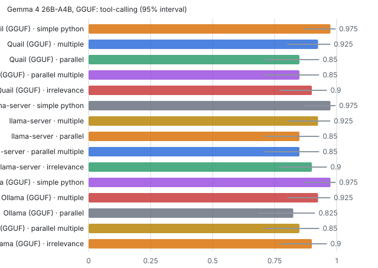

#### MLX lane (same MLX folder)

| Engine | simple python | multiple | parallel | parallel multiple | irrelevance |
|---|---:|---:|---:|---:|---:|
| Quail (MLX) | 97.5% (87%–100%, n=40) | 92.5% (80%–97%, n=40) | 85.0% (71%–93%, n=40) | 87.5% (74%–95%, n=40) | 87.5% (74%–95%, n=40) |
| oMLX | 97.5% (87%–100%, n=40) | 92.5% (80%–97%, n=40) | 82.5% (68%–91%, n=40) | 85.0% (71%–93%, n=40) | 87.5% (74%–95%, n=40) |
| Rapid-MLX | 0.0% (0%–9%, n=40) | 0.0% (0%–9%, n=40) | 0.0% (0%–9%, n=40) | 0.0% (0%–9%, n=40) | 100.0% (91%–100%, n=40) |

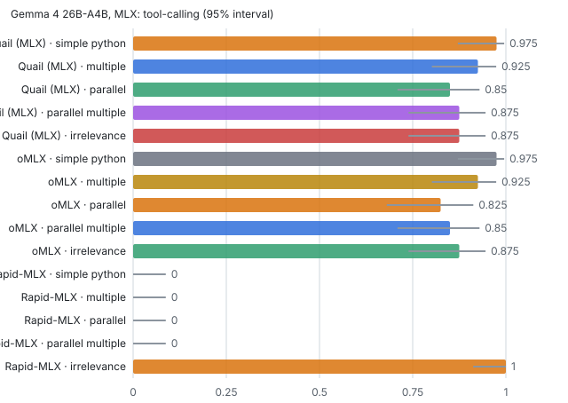

## Where Quail is slower or worse

Each cell names the engines that did better than Quail at that level, and by how much, as a share of Quail's figure: higher throughput, or shorter times. Only gaps of more than 5% and more than the spread between rounds count (D-063). Time between tokens is only compared with one request at a time.

#### Qwen3 8B, MLX lane

| Level | Throughput | Time between tokens |
|---|---|---|
| 512x256-c2 | Rapid-MLX 12% | — |
| 512x256-c4 | Rapid-MLX 13% | — |
| 512x256-c8 | Rapid-MLX 10% | — |
| 4096x128-c1 | — | oMLX 5% |

#### Qwen3.6 35B-A3B, GGUF lane

| Level | Throughput | Time to first token |
|---|---|---|
| 512x256-c1 | — | Ollama (GGUF) 8% |
| 512x256-c2 | — | llama-server 8% |
| 4096x128-c1 | Ollama (GGUF) 8% | Ollama (GGUF) 9% |

#### Qwen3.6 35B-A3B, MLX lane

| Level | Throughput | Time to first token | Time between tokens |
|---|---|---|---|
| 512x256-c1 | Rapid-MLX 7% | — | Rapid-MLX 7% |
| 512x256-c2 | Rapid-MLX 19% | Rapid-MLX 14% | — |
| 512x256-c4 | Rapid-MLX 20% | — | — |
| 512x256-c8 | Rapid-MLX 15% | — | — |
| 4096x128-c1 | — | — | oMLX 5% |

#### Gemma 4 26B-A4B, MLX lane

| Level | Throughput | Time to first token | Time between tokens |
|---|---|---|---|
| 512x256-c1 | Rapid-MLX 10% | Rapid-MLX 8% | Rapid-MLX 8% |
| 512x256-c2 | Rapid-MLX 19% | Rapid-MLX 18% | — |
| 512x256-c4 | Rapid-MLX 20% | — | — |
| 512x256-c8 | Rapid-MLX 20% | — | — |
| 4096x128-c1 | — | — | Rapid-MLX 6% |

- Gemma 4 26B-A4B, GGUF, MMLU-Pro: Ollama (GGUF) got 6 items right that Quail (GGUF) missed, against 0 the other way (McNemar p=0.031).

## Caveats

- Ollama (GGUF) ignores `ignore_eos`, so its replies' lengths were held by the prompts — Qwen3 8B, Qwen3.6 35B-A3B, Gemma 4 26B-A4B.
- oMLX ignores `ignore_eos`, so its replies' lengths were held by the prompts — Qwen3 8B, Qwen3.6 35B-A3B, Gemma 4 26B-A4B.
- Rapid-MLX ignores `ignore_eos`, so its replies' lengths were held by the prompts — Qwen3 8B, Qwen3.6 35B-A3B, Gemma 4 26B-A4B.
- Rapid-MLX didn't return a parsed tool call on /v1/chat/completions — Gemma 4 26B-A4B.
- Rapid-MLX didn't return a tool_use block on /v1/messages — Gemma 4 26B-A4B.
- Ollama (MLX) couldn't start: mlx runner failed: panic: mlx: [dequantize] Invalid quantization mode ''. at /Users/runner/work/ollama/ollama/build/darwin-sources/_deps/mlx-c-src/mlx/c/ops.… — Qwen3 8B.
- Ollama (MLX) couldn't start: mlx runner failed: panic: mlx: [quantized_matmul] The shapes of the weight and scales are incompatible based on bits and group_size. w.shape() == (256,512) a… — Qwen3.6 35B-A3B.
- Ollama (MLX) couldn't start: mlx runner failed: Error: layer 0: missing MoE expert weights (exit: exit status 1) — Gemma 4 26B-A4B.
- Ollama (GGUF) served one request at a time; its log says the "model architecture does not currently support parallel requests" — Qwen3.6 35B-A3B.
- Rapid-MLX asked for 1 of 262 quality requests to be sent again later (429 or 503 with Retry-After); they were, as a client would — Gemma 4 26B-A4B.
- Rapid-MLX asked for 15 of 262 quality requests to be sent again later (429 or 503 with Retry-After); they were, as a client would — Qwen3 8B.
- Rapid-MLX refused 4 of 204 BFCL requests (HTTP 503: The model ran out of memory during generation. Free up memory or choose a smaller model.) — Gemma 4 26B-A4B.
- Rapid-MLX asked for 35 of 204 BFCL requests to be sent again later (429 or 503 with Retry-After); they were, as a client would — Gemma 4 26B-A4B.
- Rapid-MLX refused 3 of 200 BFCL requests (HTTP 400: Tool call 'calculate_projectile_range' parameter 'initial_velocity' violates declared schema: Expected number, got str. The model produced a schema-violating…) — Qwen3 8B.
- Rapid-MLX asked for 1 of 200 BFCL requests to be sent again later (429 or 503 with Retry-After); they were, as a client would — Qwen3 8B.
- Rapid-MLX refused 133 of 200 BFCL requests (HTTP 400: Tool call 'calculate_heat' parameter 'mass' violates declared schema: Expected number, got str. The model produced a schema-violating argument value; retry w…) — Qwen3.6 35B-A3B.
- This run has two parts. The GGUF lane, and every engine's accuracy and tool calling except Quail MLX's, ran overnight on 2026-09-30 with Quail 0.61.6. The MLX lane's speed was measured again that afternoon for all four MLX engines, with Quail 0.62.0 (MLX 0.32.2), because the MLX fixes landed after the night run had started. Quail MLX's accuracy and tool calling were re-run with it. The versions table gives each engine's version.
- Quail's GGUF footprint now grows by up to about 8 GB while it serves. It keeps idle requests' caches in memory to reuse them, as llama-server does with --cache-ram (#138). That's the rise in Quail (GGUF)'s peak memory since the first run.
- Qwen3.6's chat template: llama-server and Ollama render each earlier assistant turn with 4 more tokens than Quail, oMLX and Rapid-MLX, which agree with each other. It only touches the few-shot quality prompts.
- Rapid-MLX turns on its own GPU kernels as it loads a model: for Qwen3.6, a blocked GatedDeltaNet prefill kernel, a fused GatedDeltaNet decode and a compiled single-request decode. It also caps MLX's buffer cache (12.5 GB on this Mac). oMLX applies its own patches for the Qwen3.5 family, including a GatedDeltaNet prefill kernel and quantized-MLP prefill. They're part of each engine as shipped, so they were left on.
- Neither oMLX nor Rapid-MLX used speculative decoding here. Rapid-MLX's log says "spec decode OFF" for Qwen3.6, and oMLX skipped MTP because the checkpoint has no MTP weights. Rapid-MLX's TurboQuant KV cache and prompt compression, and oMLX's TurboQuant KV, were switched off to hold every engine to a full-precision cache.

## Reproducing it

This report is the run `20260930-000102-compare-mlx` with the smoke test `20260929-235451-smoke`, by the harness at commit `88c435b`, with Quail 0.61.6. A run on another Mac gets folders named for the time it started.

What it needs (`bench/README.md` has the details):

- A Release build of Quail, in `/Applications` or from `task install`. The harness runs the app's own `quail-server` and `llama-server`, not the app.
- The models in Quail's store, as a GGUF file and an MLX folder each (`bench/config/models.toml`). `task bench:doctor` says which are missing.
- `uv` and Rapid-MLX (`brew install uv rapid-mlx`). `task bench:setup` fetches the rest: oMLX, Ollama, llama.cpp's tools, GuideLLM, mlx-lm, lm-eval and BFCL, at pinned versions.
- Passwordless `sudo` for `/usr/bin/powermetrics` and `/usr/bin/mdutil`: the thermal gate and pausing Spotlight. Without it the run goes on, and records that it couldn't.
- Mains power, about 100 GB free, and no other LLM server running. A timed run refuses to start otherwise.

```
task bench:setup
task bench:smoke
task bench:compare BUDGET=night
task bench:report RUN=<the compare run's folder> SMOKE=<the smoke run's folder>
```

`BUDGET=night` is 2 speed rounds of 6 requests per stream at each level; the first 150 GSM8K items, the first 8 MMLU-Pro items per subject and the first 40 BFCL cases per category.
