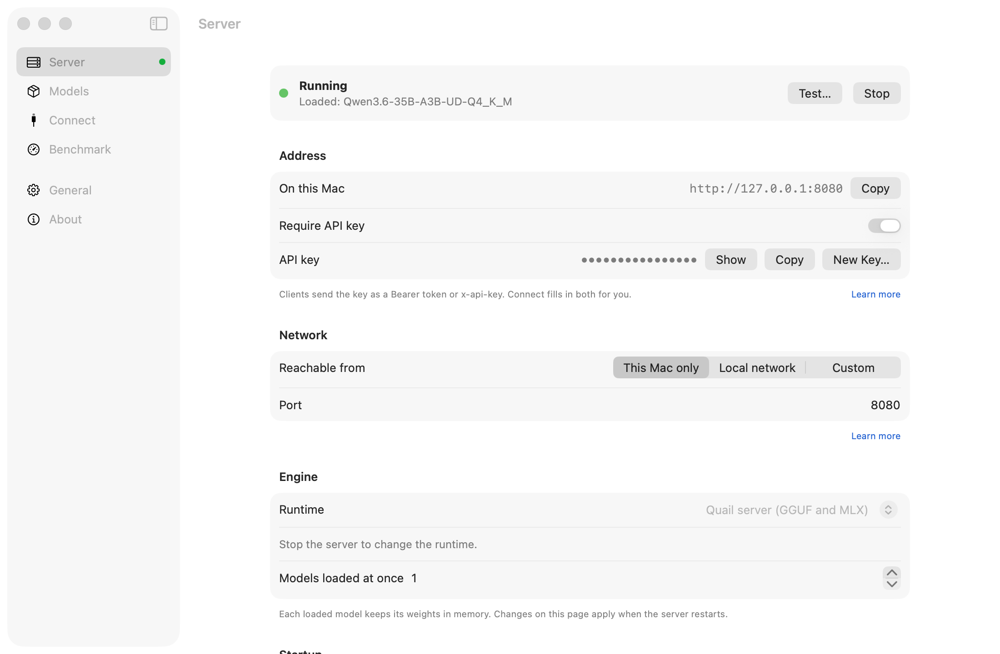

# Quail launch article (Medium draft)

Draft of 4 October 2026 · Arif Datoo · edited in [Claude Docs](https://claude.ai/code/artifact/4034cdfd-6d03-4ae4-95f6-c224f9bfd75d)

## Quail: a deliberately boring local-model server for the Mac

*An open-source Mac app that serves local models to the tools you already use, and then gets out of the way.*



*Quail's Server page: running, with an API key required and reachable from this Mac only.*

If you've ever installed Postgres.app, you know the feeling. You drag an elephant into Applications, click it, and there's a database. No installer, no config files, no services to chase down. When you need it, it's in the menu bar. When you don't, you forget it exists.

Running models locally on a Mac is in good shape these days. Ollama, LM Studio, oMLX and others all work well, and most of them now come with a chat window, and often image generation, voice and agents too. I wanted the narrow version: a server and nothing else, as dull and dependable as Postgres.app.

So I built Quail. It has reached 1.0, and it's free and open source. I'll be upfront below about where the alternatives are just as good or better.

```
brew install --cask adatoo/tap/quail-ai
quail launch claude
```

That's Claude Code running on a model on your own Mac. The rest of this post is why Quail works the way it does.

## The inspiration: Postgres.app

[Postgres.app](https://postgresapp.com/) calls itself "the easiest way to get started with PostgreSQL on the Mac". It's "a full-featured PostgreSQL installation packaged as a standard Mac app", installed in three steps: "Download ➜ Move to Applications folder ➜ Double Click". It was never trying to be a database IDE. It runs the server, sits in the menu bar, and lets every other tool (psql, Rails, Django, TablePlus) connect to it.

Quail borrows five ideas from it:

1. **It's a server, not a destination.** Postgres.app doesn't replace your SQL client; Quail doesn't replace your coding agent, your editor or your chat app. It gives them a model to talk to.
2. **A real Mac app.** Signed, notarized, drag-to-install or one Homebrew line, and it updates itself. No Python environment, no terminal required.
3. **The menu bar is the interface.** Start, stop, see what's loaded and what it's doing, then close the window and get on with your work.
4. **The command line is there when you want it.** Postgres.app ships psql; Quail ships a `quail` command (`pull`, `chat`, `launch`, `bench`).
5. **Standard interfaces, so nothing is locked in.** Postgres speaks the Postgres wire protocol; Quail speaks OpenAI's and Anthropic's APIs, so any tool that can point at OpenAI or Claude can point at Quail.

None of these ideas is mine alone: Ollama and oMLX share several of them. Quail is my attempt to follow all five strictly, and to stop there.

## A tool for your tools, and nothing more

Almost every local-AI tool now serves other apps through an API. Where they differ is what else they bundle: a chat window, an image studio, voice, agents. That's a fine product if you want it, and plenty of people do.

Quail leaves all of that to the apps you already use. Beyond a small page for trying a model in your browser, it has no chat app, and no agents, no image studio, no account and no cloud. It's plumbing: a server on your Mac that the tools you already chose can use.

- **Your coding agent** (Claude Code, Codex, opencode, Qwen Code, aider, Goose) points at Quail, or `quail launch claude` starts it already pointed there.
- **Your editor** (Continue, Cline, Roo Code, Zed) and **your chat app** (Open WebUI, LibreChat) get copy-ready settings with a Test button.
- **Your own code** uses the OpenAI or Anthropic SDK as it would anywhere else, including embeddings and reranking for search.

If you stop using Quail tomorrow, nothing you built depends on it. Your tools speak the same APIs to any other server, and your models are ordinary GGUF and MLX files in a folder you can see.

## What it does today

- **One server for GGUF and MLX.** Quail's own server runs llama.cpp for GGUF and Apple's MLX for MLX models, from one model folder, with no Python inside. It serves several requests at once, and vision and tool calling work across the main model families.
- **It tells you what fits before you download.** Every model gets a verdict for your Mac (comfortable, tight, won't fit) and an estimated speed, and its context is sized to your memory. A curated catalog recommends models for your memory, alongside over a hundred MLX models, any GGUF on Hugging Face, and the models other apps already downloaded.
- **It measures itself:** a built-in benchmark, the same on every Mac, so you can compare models and settings.
- **It's private by default.** It listens only to your Mac, requires an API key from the start, refuses requests from web pages you haven't allowed, works offline once models are downloaded, and sends no usage data.

## Why another one? Honestly, you may not need it

Ollama, LM Studio, Nativ, oMLX and Rapid-MLX all run models on a Mac, and all of them can serve other apps. If you already use one and it works, that's a good reason to keep it.


*Checked on 3 October 2026 against each project's own docs and source. Every claim is sourced at quail-ai.app/compare.html.*

- **Ollama does most of what Quail does.** It's a Mac app with no Python, it serves GGUF and MLX, it sets up coding tools with `ollama launch`, it has its own chat window, and it runs on Linux and Windows too. It's the safe default.
- **oMLX is the closest to Quail in spirit:** a native menu-bar server for MLX models, with a dashboard and its own chat.
- **If you want an all-in-one AI app**, use LM Studio or Nativ. Quail won't become that.
- **If you want every last token per second from MLX**, use Rapid-MLX. It's 7–10% faster than Quail on a single request and 10–20% faster with several at once, and I say so on Quail's own website.

So what's left for Quail is a combination, not a category. No single item below is unique, but I haven't found another tool that does all of them:

- **GGUF and MLX from one server**, as ordinary files in a folder you can see, with no import into a private store.
- **Locked down from the start:** an API key is on before you've changed a setting, and web pages you haven't allowed are refused.
- **A fit verdict before you download**, with an estimated speed.
- **Several requests at once by default**, on both formats.
- **No Python inside**, and nothing bundled beyond the server.

If none of that matters to you, Ollama is a fine answer, and I'd like to hear that too.

I also didn't want to claim "fast" without proof. Quail is measured against llama.cpp's own server, Ollama, oMLX and Rapid-MLX on the same Mac, the same model files and the same prompts. On GGUF it's level with llama.cpp's server. On MLX it gives the fastest first token when several requests arrive at once. Its answers score the same on maths, knowledge and tool calling. Every result, including where Quail is slower, is published: [the comparison](https://quail-ai.app/compare.html).

## Pure open source, built in the open

Quail is MIT licensed, with no paid tier, no account and no telemetry. The whole thing is on GitHub: the app, its server, the website and the benchmark harness.

It's built in the open in a second sense too. Every significant choice is written down as a decision record, with the alternatives and what would make me change my mind: why the server is Swift rather than Python, why there's no chat window, why the API key is on from the start. The implementation plan says what's next. The benchmark reports are in the repository with their raw results, so you can rerun them on your own Mac and check my numbers.

## Tell me what's wrong with it

1.0 means it's ready to rely on, not that it's finished, and I'd much rather hear what doesn't work for you than guess.

- **Found a bug, or a tool that won't connect?** [Open an issue](https://github.com/adatoo/quail/issues). The app's About page has a Copy Details button with your Mac, macOS and Quail versions, which makes it quicker to fix.
- **Tried it and would still use Ollama or oMLX?** Tell me why. That's the most useful thing you can send me.
- **Spotted a wrong claim on the comparison page?** Tell me: every cell links its source, and I'd rather correct it than defend it.
- **Want to fix something yourself?** Pull requests are welcome. The repository has a guide for contributors, and the decision records explain why things are the way they are before you change them.
- **Want to know what's next?** It's all on GitHub: serving speech, images and MCP through the same API is the next stretch of work, and closing the remaining MLX speed gap is ongoing.

## Try it in five minutes

You need an Apple silicon Mac on macOS 14 or later.

1. Install it: `brew install --cask adatoo/tap/quail-ai`, or download the DMG from [quail-ai.app](https://quail-ai.app) and drag it to Applications.
2. Click **Add Model…** and pick one marked as comfortable for your Mac. A small one, such as Qwen3 0.6B, downloads in a minute.
3. Click **Start**, then **Test**.
4. Point a tool at it from the **Connect** page, or run `quail launch claude` to start Claude Code on your local model.

That's it. It lives in your menu bar from now on, and updates itself.

*Quail is free and open source under the MIT licence: [github.com/adatoo/quail](https://github.com/adatoo/quail).*

## Author's notes (not for publication): is Quail superfluous?

**Mostly yes, as a product, unless the narrow combination resonates.** Every tool on the map both serves other apps and has a chat UI of its own. Quail isn't a new category.

- **The real neighbours are Ollama and oMLX.** Ollama is a signed Mac app with a chat window, GGUF and MLX, no Python and `ollama launch`; it imports models into its own store, has no API key and runs one request at a time by default. oMLX is "Postgres.app for local models" for MLX only: a native SwiftUI menu-bar app, a dashboard with chat, batching and `omlx launch`; Python inside and any web page allowed by default.
- **Quail's honest case is the combination:** both formats from one server as plain files, an API key on from the start, fit verdicts, several requests at once by default, no Python and a narrow scope. Any one of these could be copied; if Ollama turned keys on by default and stopped importing models, most of the case would go.
- **Don't lead with speed.** It's level with llama-server on GGUF and behind Rapid-MLX on MLX. The published comparison, losses included, is where the credibility comes from.
- **"Fits before you download" is unverified as a difference:** LM Studio may show memory estimates. The article doesn't claim it's unique.

**Pass marks for the launch, set beforehand:**

- Strangers file issues or pull requests in the first two weeks.
- At least a few people say they switched from Ollama or oMLX, or would, and why.
- If the main reply is "neat, but I'll stick with Ollama", that's the answer. Keep Quail as a well-made personal tool, or narrow it further. Don't chase feature parity.

**Where to post it:** Show HN, r/LocalLLaMA and r/macapps alongside Medium. Lead with the five-minute setup and `quail launch claude`, and say in the first reply that Ollama and oMLX are close.

**Title options:**

- Quail: a deliberately boring local-model server for the Mac
- I built a menu-bar server for local AI models, and published where it's slower
- Postgres.app, but for local AI models (only with the honest framing; HN will push back otherwise)

**Published:** 7 October 2026 on [Medium](https://medium.com/@arif_84930/quail-a-deliberately-boring-local-model-server-for-the-mac-c70e11791985), with the Server page screenshot as the cover image. The draft line and these notes were left out.
