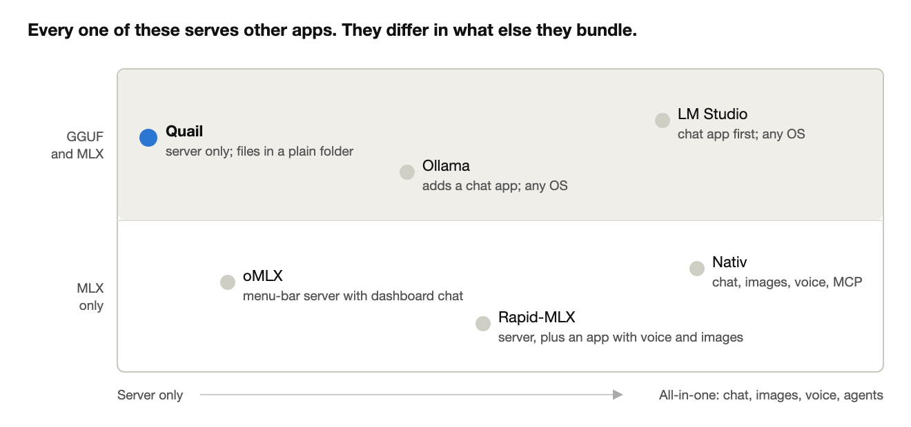

# Quail launch article (Medium draft)

Draft of 4 October 2026 · Arif Datoo · edited in [Claude Docs](https://claude.ai/code/artifact/4034cdfd-6d03-4ae4-95f6-c224f9bfd75d)

## Quail: running a local AI model should be as boring as running a local database

*An open-source Mac app that serves local models to the tools you already use, and then gets out of the way.*

If you've ever installed Postgres.app, you know the feeling. You drag an elephant into Applications, click it, and there's a database. No installer, no config files, no services to chase down. When you need it, it's in the menu bar. When you don't, you forget it exists.

Running AI models locally on a Mac doesn't feel like that yet. You pick between a dozen apps and servers, each with its own store of models, its own chat window and its own idea of which tools it works with. Then you work out by trial and error whether a model even fits in your Mac's memory.

I built Quail to make it boring. It has reached 1.0, and it's free and open source.

```
brew install --cask adatoo/tap/quail-ai
quail launch claude
```

That's Claude Code running on a model on your own Mac. The rest of this post is why Quail works the way it does.

## The inspiration: Postgres.app

[Postgres.app](https://postgresapp.com/) calls itself "the easiest way to get started with PostgreSQL on the Mac". It's "a full-featured PostgreSQL installation packaged as a standard Mac app", installed in three steps: "Download ➜ Move to Applications folder ➜ Double Click". It was never trying to be a database IDE. It runs the server, sits in the menu bar, and lets every other tool (psql, Rails, Django, TablePlus) connect to it.

Quail borrows five ideas from it:

1. **It's a server, not a destination.** Postgres.app doesn't replace your SQL client; Quail doesn't replace your coding agent, your editor or your chat app. It gives them a model to talk to.
2. **A real Mac app.** Signed, notarized, drag-to-install or one Homebrew line, and it updates itself. No Python environment, no terminal required.
3. **The menu bar is the interface.** Start, stop, see what's loaded and what it's doing, then close the window and get on with your work.
4. **The command line is there when you want it.** Postgres.app ships psql; Quail ships a `quail` command (`pull`, `chat`, `launch`, `bench`).
5. **Standard interfaces, so nothing is locked in.** Postgres speaks the Postgres wire protocol; Quail speaks OpenAI's and Anthropic's APIs, so any tool that can point at OpenAI or Claude can point at Quail.

If Postgres.app is "PostgreSQL, the Mac way", Quail aims to be "local models, the Mac way".

## A tool for your tools, not another walled garden

Most local-AI apps want to be where you spend your day: their chat window, their agent, their image studio, their account. That's a fine product, but it means the model lives inside someone else's app.

Quail goes the other way. Beyond a small page for trying a model in your browser, it has no chat app, and no agents, no image studio, no account and no cloud. It's plumbing: a server on your Mac that the tools you already chose can use.

- **Your coding agent** (Claude Code, Codex, opencode, Qwen Code, aider, Goose) points at Quail, or `quail launch claude` starts it already pointed there.
- **Your editor** (Continue, Cline, Roo Code, Zed) and **your chat app** (Open WebUI, LibreChat) get copy-ready settings with a Test button.
- **Your own code** uses the OpenAI or Anthropic SDK as it would anywhere else, including embeddings and reranking for search.

If you stop using Quail tomorrow, nothing you built depends on it. Your tools speak the same APIs to any other server, and your models are ordinary GGUF and MLX files in a folder you can see.

## What it does today

- **One server for GGUF and MLX.** Quail's own server runs llama.cpp for GGUF and Apple's MLX for MLX models, from one model folder, with no Python inside. It serves several requests at once, and vision and tool calling work across the main model families.
- **It knows what fits before you download.** Every model gets a verdict for your Mac (comfortable, tight, won't fit) and an estimated speed. A curated catalog recommends models for your memory, alongside over a hundred MLX models, any GGUF on Hugging Face, and the models other apps already downloaded.
- **It measures itself:** a built-in benchmark, the same on every Mac, so you can compare models and settings.
- **It's private by default.** It listens only to your Mac, requires an API key from the start, refuses requests from web pages you haven't allowed, works offline once models are downloaded, and sends no usage data.

## Why another one?

It's a fair question: Ollama, LM Studio, Nativ, oMLX and Rapid-MLX all run models on a Mac, and most of them do it well. Here's where Quail fits, and where you'd be better served elsewhere.



- **If you want an all-in-one AI app**, use LM Studio, the established chat app, or Nativ, which adds image generation, voice and MCP tools in one window. Quail won't become that.
- **If you need Linux or Windows**, use Ollama. Quail is Mac-only, on purpose.
- **If you want every last token per second from MLX**, use Rapid-MLX. It's 7–10% faster than Quail on a single request and 10–20% faster with several at once, and I say so on Quail's own website.
- **If you want a server for your Mac that your tools share**, as boring and dependable as Postgres.app, that's Quail. It's the only one of these that serves both GGUF and MLX from one native server with no Python, tells you what fits before you download, and starts locked down (an API key on, web pages refused) rather than open.

I also didn't want to claim "fast" without proof. Quail is measured against llama.cpp's own server, Ollama, oMLX and Rapid-MLX on the same Mac, the same model files and the same prompts. On GGUF it's level with llama.cpp's server. On MLX it gives the fastest first token when several requests arrive at once. Its answers score the same on maths, knowledge and tool calling. Every result, including where Quail is slower, is published: [the comparison](https://quail-ai.app/compare.html).

## Pure open source, built in the open

Quail is MIT licensed, with no paid tier, no account and no telemetry. The whole thing is on GitHub: the app, its server, the website and the benchmark harness.

It's built in the open in a second sense too. Every significant choice is written down as a decision record, with the alternatives and what would make me change my mind: why the server is Swift rather than Python, why there's no chat window, why the API key is on from the start. The implementation plan says what's next. The benchmark reports are in the repository with their raw results, so you can rerun them on your own Mac and check my numbers.

## Tell me what's wrong with it

1.0 means it's ready to rely on, not that it's finished, and I'd much rather hear what doesn't work for you than guess.

- **Found a bug, or a tool that won't connect?** [Open an issue](https://github.com/adatoo/quail/issues). The app's About page has a Copy Details button with your Mac, macOS and Quail versions, which makes it quicker to fix.
- **Spotted a wrong claim on the comparison page?** Tell me: every cell links its source, and I'd rather correct it than defend it.
- **Want to fix something yourself?** Pull requests are welcome. The repository has a guide for contributors, and the decision records explain why things are the way they are before you change them.
- **Want to know what's next?** It's all on GitHub: serving speech, images and MCP through the same API is the next stretch of work, and closing the remaining MLX speed gap is ongoing.

## Try it in five minutes

You need an Apple silicon Mac on macOS 14 or later.

1. Install it: `brew install --cask adatoo/tap/quail-ai`, or download the DMG from [quail-ai.app](https://quail-ai.app) and drag it to Applications.
2. Click **Add Model…** and pick one marked as comfortable for your Mac. A small one, such as Qwen3 0.6B, downloads in a minute.
3. Click **Start**, then **Test**.
4. Point a tool at it from the **Connect** page, or run `quail launch claude` to start Claude Code on your local model.

That's it. It lives in your menu bar from now on, and updates itself.

*Quail is free and open source under the MIT licence: [github.com/adatoo/quail](https://github.com/adatoo/quail).*

## Author's notes (not for publication): is Quail superfluous?

The market is crowded, but not in Quail's corner of it. Almost every alternative is either an app you work inside, or a server that isn't a Mac app. Quail is a Mac app whose whole job is to be a server for other tools, and that's the slot Postgres.app filled for databases.

Quail's corner of the map (in the article above) holds two MLX-only Python servers; Ollama is the nearest rival but spans every OS.

- **The real neighbours are Ollama, oMLX and Rapid-MLX, not Nativ.** Nativ and LM Studio are destinations: chat, images, voice, MCP in their own window. Quail deliberately isn't, so it doesn't compete with them; it can even serve them.
- **Against Ollama:** Ollama is the default answer and runs on Linux and Windows. Quail's case is Mac-native GGUF and MLX from one server, secure defaults (key on, web pages refused; Ollama has neither), fit verdicts before download, and several requests at once by default.
- **Against oMLX and Rapid-MLX:** both are MLX only, ship Python, and accept requests from any web page by default. Rapid-MLX is faster with several requests at once; say so, as the article does.
- **Lead with the shape, not speed.** "Postgres.app for local models" and "a tool for your tools" are claims nobody else is making. "Fastest" is a claim several projects make, and Quail only wins it in places.
- **The published comparison, losses included, is the credibility.** Few projects publish where they're slower. It answers "why should I trust a new tool" better than any adjective.

**What would make it superfluous:** if Ollama added a native menu-bar app with secure defaults and fit checks, or if people mostly want an all-in-one app. The launch tests that cheaply: if the feedback is "I'd just use Ollama", that's the signal to listen to.

**Where to post it:** Show HN, r/LocalLLaMA and r/macapps alongside Medium. Lead with the five-minute setup and `quail launch claude`, since local coding agents are the use people are actively trying to solve.

**Title options:**

- Quail: running a local AI model should be as boring as running a local database
- Postgres.app, but for local AI models
- I built a menu-bar server for local AI models, and published where it's slower

**Before publishing:** check the Postgres.app quotes against postgresapp.com; add a menu-bar screenshot as the cover image; leave out the draft line and these notes.
